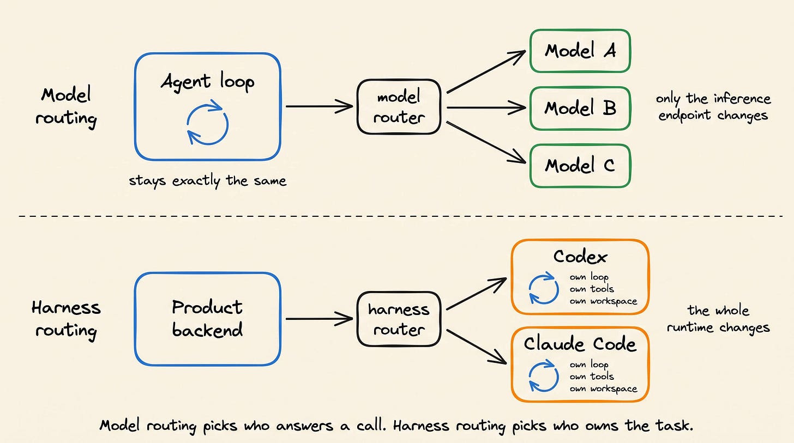

# HarnessRouter

- Git Repo
  - https://github.com/HarnessRouter/harnessrouter
- Website
  - https://harnessrouter.ai/

> [!NOTE]
> HarnessRouter Community Edition: the self-hosted, Apache-2.0 edition of the unified interface for agent harnesses. Run Codex, Claude Code, Hermes, PI, DSH, and more through one API, with sessions, streaming, files, cancellation, and failure handling. Implements the Unified Harness Protocol (UHP), an open standard. Your keys, your infrastructure.

## 2026-09-19

- 緣起：
  - 從 2026-09-19 的 Daily Dose of DS 電子報 「 Run Any Agent Harness Under One Interface 」看到的。
- 概念：
  - 
- 感想：
  - 先前在 Databricks Omnigent 看到 Meta-Harness 的概念。有的 Harness 可以支援 Multi-Agent。
  - 每個 Agent 可以透過 Model Router 根據需求切換 Model 來節省成本。
  - 這個 Harness Router 的設計有點延伸了 Omnigent 的概念，讓應用程式可以把不同的 Harness 視為後端 Backend。
  - 雖然 Harness Router 背後與 Model Router 背後應該也有其判斷邏輯，不過可能只有實作過才能對背後的原理更有感覺。
  - 回顧了一下 Omnigent 的架構，對比 HarnessRouter 的架構，兩者看起來很相似，都有 CLI - Server(Gateway) - Runner 三層。
    看起來只能實際比較一下 Omnigent 跟 HarnessRouter 的運作才能窺探兩者是否有不同。
- 研究：
  - 用 Pi Agent + llama.cpp/Qwen3.5-9B:64K 幫我快速整理中文技術報告，以利快速理解這個專案。

> [!QUESTION]
> 根據 https://github.com/HarnessRouter/harnessrouter 內容撰寫一篇技術報告，包括 step-by-step 測試步驟，經 /skill:speak-human-tw 潤飾詞句後，存成 harnessrouter.md

## HarnessRouter 技術報告

### 1. 系統概述

HarnessRouter 是一個統一介面，用於整合各種 agent harnesses（代理運行環境）。它讓開發者能夠在不處理複雜的 harness 工程的情況下，快速構建 agent 產品。該系統實施了 Unified Harness Protocol (UHP)，並提供與 OpenAI Responses API 相容的介面。

#### 1.1 核心功能

- **統一 API**：將現有 harness（如 Codex、Claude Code）轉換為即插即用型 backend
- **成本優化**：相比傳統方式，成本降低 99.8%（從 223 降至 0.47 credits）
- **效能提升**：端到端延遲提升 3.2 倍（從 4 分 36 秒降至 1 分 25 秒）
- **模組化架構**：支援透過單一 API 切換不同 harness

### 2. 架構設計

#### 2.1 架構圖

```
┌─ HarnessRouter 容器 ─────────────────────────────────┐
│  Console :3000   ← 僅公開的埠                        │
│       │ 相同來源 proxy                                │
│       ▼                                               │
│  Gateway :8080   Responses API + harness lifecycle    │
│       │ loopback                                      │
│       ▼                                               │
│  Runner  :8081   在 session workspaces 中運行 harnesses│
│                                                       │
│  /data volume   資料庫 · 檔案 · secrets · workspaces   │
└───────────────────────────────────────────────────────┘
```

#### 2.2 設計原則

- **容器化部署**：單一 Docker 部署即可包含 Console、Gateway 和 Runner
- **隔離的 Session**：每個 session 使用獨立的 workspaces 和操作系統用戶
- **安全性**：agent 無法存取其他 session 的檔案、資料庫或 blob store
- **無外部依賴**：無需聯絡控制平面或管理型資料庫

### 3. 安裝與設定步驟

#### 3.1 前置條件

- Docker
- 約 4 GB 硬碟空間
- 模型提供者 API key（如 OpenAI、Anthropic 等）

#### 3.2 Step-by-Step 測試步驟

##### 步驟 1：下載映像檔

```bash
docker pull harnessrouter/harnessrouter
```

*預期結果*：約 700 MB 的映像檔開始下載。

##### 步驟 2：啟動容器

```bash
docker run -d --name harnessrouter \
  -p 127.0.0.1:3000:3000 \
  -v harnessrouter:/data \
  harnessrouter/harnessrouter
```

*參數說明*：
- `-p 127.0.0.1:3000:3000`：僅在本機公開埠 3000
- `-v harnessrouter:/data`：持久化儲存資料庫、檔案和安裝的 CLIs
- **不要**使用 `--user`：entrypoint 需要 root 權限來管理 per-session 用戶

##### 步驟 3：等待啟動完成

```bash
docker logs -f harnessrouter
```

*預期輸出*：
```
[harnessrouter] installing Claude Code (Anthropic's terms apply)…
[harnessrouter] installing opencode (MIT)…
[harnessrouter] installing Qwen Code (Apache-2.0)…
[harnessrouter] installing Gemini CLI (Apache-2.0)…
[harnessrouter] installing Cline (Apache-2.0)…
[harnessrouter] installing Codex (Apache-2.0)…
[harnessrouter] installing Pi (MIT) and its MCP adapter (MIT)…
[harnessrouter] installing Oh My Pi (MIT)…
[harnessrouter] installing goose (Apache-2.0)…
[harnessrouter] installing DeepSeek Harness (MIT, developer preview — version-pinned)…
[harnessrouter] installing Hermes (check its upstream license before use)…
[harnessrouter] data=/data  backends available: claude codex hermes pi dsh opencode qwen gemini cline omp goose kimi
[harnessrouter] ready on :3000
```

*安裝的 harnesses*：
- Claude Code
- OpenCode
- Qwen Code
- Gemini CLI
- Cline
- Codex
- Pi + MCP adapter
- Oh My Pi
- Goose
- DeepSeek Harness
- Hermes

##### 步驟 4：登入系統

1. 開啟瀏覽器訪問 `http://localhost:3000`
2. 使用預設憑證登入：
   - **Username**: `harnessrouter`
   - **Password**: `harnessrouter`

> **重要警告**：登入後立即在 Profile 中更改預設密碼，否則不要將實例公開到網路。

##### 步驟 5：連接模型提供者

1. 在側邊欄選擇 **Bring Your Own Key**（Integrations）
2. 點擊 **Add Integration**
3. 選擇提供者並輸入 API key

*支援的提供者類型*：
- Anthropic
- OpenAI
- Custom（自定義端點）
- Azure Foundry
- Google
- Bedrock
- TokenRouter
- Vercel
- LLMtr

*自定義端點配置範例*：
```json
{
  "integrations": [
    {
      "name": "proxy-anthropic",
      "provider": "custom",
      "config": {
        "api_format": "anthropic",
        "base_url": "https://proxy.internal/anthropic",
        "api_key": "sk-ant-…"
      },
      "models": [
        {"canonical": "claude-opus-4.8", "provider_id": "anthropic--claude-4.8-opus"}
      ]
    }
  ],
  "model_map": {
    "claude-opus-4.8": "proxy-anthropic"
  }
}
```

##### 步驟 6：執行第一個任務

1. 選擇 **Agent harnesses**
2. 選擇已安裝的 harness
3. 點擊 **New task**
4. 選擇模型並輸入任務描述

*範例任務*：
```
請幫我檢查這個 NDA 文件，並產生以下三個輸出：
1. 紅線版本的 NDA
2. 乾淨的無格式版本
3. 談判建議備忘錄
```

*預期結果*：系統會即時串流顯示 agent 執行的每個命令、觸碰的檔案，以及最終產出的文件。

### 4. 自訂 Harness 配置

#### 4.1 建立自訂 harness

1. **建立**：在 **Agent harnesses** 中選擇 **New harness**
2. **設定基本參數**：
   - Name：harness 名稱
   - Base harness：底層 harness
   - Default model：預設模型
3. **自訂設定**：
   - 在 **Harness Settings** 中設定 **Agent instructions**
   - 配置 **Tools**（可使用 **Add MCP** 選取性加入 MCP server）
   - 根據需要加入 **Skills**
4. **儲存並測試**：選擇 **Save Changes**，然後 **Run Task** 測試配置

#### 4.2 重要限制

- **無法變更**：base harness 在建立後無法更改
- **可變更**：預設模型可在 Settings 中隨時修改

### 5. API 整合

#### 5.1 取得 API key

1. 在 Console 側邊欄選擇 **API Keys**
2. 選擇 **Create API key**
3. 複製並妥善儲存顯示的 secret（作為 `HARNESSROUTER_API_KEY`）

> **安全警告**：此 CE 發行的 key 與 Console 密碼和提供者 key 是分開的，切勿在瀏覽器程式碼中暴露。

#### 5.2 API 呼叫範例

```bash
export HARNESSROUTER_BASE_URL=http://localhost:3000/api/harness

export HARNESSROUTER_API_KEY="your-api-key"

curl --fail-with-body -sS "$HARNESSROUTER_BASE_URL/v1/responses" \
  -H "Authorization: Bearer $HARNESSROUTER_API_KEY" \
  -H 'content-type: application/json' \
  -d '{
    "input":"Reply with exactly: it works.",
    "metadata":{"harness_id":"codex"},
    "model":"gpt-5.4-mini",
    "stream":false
  }'
```

#### 5.3 API 功能列表

| 功能 | 實現方式 |
|------|----------|
| 啟動任務 | 發送指令並檢查執行狀態 |
| 繼續會話 | 使用 `previous_response_id` 發送後續指令 |
| 串流進度 | 接收 agent 工作時的即時更新 |
| 檔案處理 | 附加輸入檔案並檢索產生的輸出 |
| 取消任務 | 停止不再需要的任務 |
| 檢查執行 | 檢視結構化錯誤和執行追蹤 |

### 6. Starter Kits 範例

#### 6.1 Slides（幻燈片）

將簡報簡述轉化為可編輯的幻燈片內容和佈局。

*範例任務*：
```
「一個 5 頁幻燈片，說明容器映像檔是什麼，適合新工程師」
```

#### 6.2 Sheets（試算表）

使用每一行的資料執行任務，並將結果寫回試算表。

*範例任務*：
```
「幫我建立一個試算表，目標是用來將矽谷投資人的資料映射出來，以便提供給矽谷以外的投資者」
```

#### 6.3 Dashboards（儀表板）

讀取資料庫 schema 並寫入 SQL 查詢以驅動儀表板圖表。

*範例任務*：
```
「每月收入以及按收入排名前 5 的國家，加上總付費收入」
```

#### 6.4 Videos（影片）

將簡述轉化為拍攝計劃，並呼叫影片工具為時間軸產生片段。

> **注意**：這是唯一按輸出時間而非每次轉數收費的 kit，因為每個片段都是生成過程。

### 7. 部署選項

#### 7.1 自我托管（Community Edition）

**優點**：
- 使用自有基礎設施
- 完全控制提供者憑證和狀態
- 資料庫、檔案、session 和 workspaces 均由您控制
- 無 Console 產品分析儀表板

#### 7.2 雲端部署（HarnessRouter Cloud）

**適合場景**：
- 需要託管部署、維護和擴展
- 希望在 serverless 隔離沙盒中執行任務
- 希望透過相同 API 合約使用服務

#### 7.3 從本地遷移至雲端

1. 在本地設定 `HR_SECRET_KEY` 加密目的 key
2. 在 **Settings** 中儲存自訂 harness
3. 選擇 **Upload to Cloud**
4. 使用雲端 workspace API key 連接目的端點

*上傳內容*：harness 配置（不包括提供者 key、session 或產生的檔案）

### 8. 安全考量

#### 8.1 密碼管理

- 預設密碼 `harnessrouter/harnessrouter` 僅在首次登入時使用
- 登入後必須立即更改密碼
- 密碼儲存在 `/data/selfhost-auth.json`（儲存的是 hash，而非明文）

#### 8.2 資料庫連接安全

1. 使用 `HR_SECRET_KEY` 加密儲存的連接字串
2. 僅使用 read-only 資料庫帳號
3. 查詢僅允許 `SELECT` 操作
4. 資料庫連接字串在查詢執行時才解析

#### 8.3 權限隔離

- 每個 agent 運行在自己的 session 用戶下
- agent 無法存取其他 session 的檔案或資料庫
- 容器啟動時使用 root，但 agent 過程使用其 session 的用戶

### 9. 升級與備份

#### 9.1 升級步驟

1. 備份 `/data` volume
2. `docker pull harnessrouter/harnessrouter`（下載新映像）
3. 停止並刪除舊容器
4. 使用相同 volume、埠和配置重新建立容器

```bash
docker stop harnessrouter
docker rm harnessrouter
docker run -d --name harnessrouter \
  -p 127.0.0.1:3000:3000 \
  -v harnessrouter:/data \
  harnessrouter/harnessrouter
```

#### 9.2 備份策略

- 停止容器後複製 volume（確保資料庫檔案一致性）
- 保留 volume 權限和配置的加密 key
- 避免使用 `docker compose down -v`，這會刪除 volumes

#### 9.3 還原步驟

1. 將備份的 volume 複製到新環境
2. 確保加密 key 與原環境相同
3. 啟動新容器並連接到 volume

### 10. 開源協議與授權

#### 10.1 協議

- **HarnessRouter Community Edition**：Apache 2.0
- **Agent harness CLIs**：各自的上游授權條款適用
- **Starter Kits**：使用不同的授權條款（見 https://github.com/HarnessRouter/starter-kit#licensing）

#### 10.2 注意事項

- 映像中包含的工具剩餘其上溯的授權條款
- 使用前應檢視 [NOTICE](NOTICE) 和每個工具的條款
- 映像不包含捆綁的模型或試用 key

### 11. 資源與參考

#### 11.1 官方文件

- [Cloud 與整合文件](https://harnessrouter.ai/docs)
- [API 指南](#api)
- [Starter Kits](https://github.com/HarnessRouter/starter-kit)
- [設置與操作指南](docs/self-hosting-guide.md)

#### 11.2 統一 Harness 協議（UHP）

- [規範協議行為](https://github.com/HarnessRouter/harnessrouter/blob/main/protocol/versions/2026-09-12)
- [OpenAI Responses 相容性](https://github.com/HarnessRouter/harnessrouter/blob/main/protocol/README.md#relationship-to-the-openai-responses-api)
- [OpenAPI 和 JSON Schema](https://github.com/HarnessRouter/harnessrouter/blob/main/protocol/schema)
- [相容性測試套件](https://github.com/HarnessRouter/harnessrouter/blob/main/protocol/conformance)
- [治理模式](https://github.com/HarnessRouter/harnessrouter/blob/main/protocol/GOVERNANCE.md)

#### 11.3 社群資源

- [加入社群（Discord）](https://discord.gg/nPcbwqVPb2)
- [貢獻指南](CONTRIBUTING.md)
- [LinkedIn](https://linkedin.com/company/harnessrouter/)
- [X (Twitter)](https://x.com/HARNESSROUTER)
- [安全性政策](SECURITY.md)

### 12. 結論

HarnessRouter 提供了一個強大的平台，讓開發者能夠快速整合各種 agent harnesses，同時保持對成本和效能的控制。其模組化架構、統一 API 和完善的開源協議，使其成為構建 agent 產品的理想選擇。無論是自我托管還是雲端部署，該系統都能滿足不同場景的需求。

*報告編寫日期：2026 年 9 月*
*來源：https://github.com/HarnessRouter/harnessrouter*