# hermes-agent

- Git Repo
  - https://github.com/nousresearch/hermes-agent
- Website
  - https://hermes-agent.nousresearch.com/

## 2026-03-01

- read from AlphaSignal 2026-02-27 Newsletter

| | | |
|---|---|---|
| 3 | [Nous Research launches Hermes Agent, an open source AI agent that learns your projects and gets more capable over time](https://app.alphasignal.ai/c?uid=11vDLRFK5ryfvXd7K&cid=c70d24b4b129c634&lid=8yXh3lpirRPNsWw8) | 3,096 Likes |

- 花了一些時間研究 Nous Research 的官網，感覺是個蠻有趣的營利組織
  - https://nousresearch.com/

<table><tr style="background-color:lightyellow;"><td>Q:</td><td>
who own Nous Research?
</td></tr></table>

As a private entity, **Nous Research** is not owned by a single individual or parent company. Instead, it is owned by its **founders**, **employees**, and a group of **venture capital investors**.

Founded in 2023, the organization transitioned from an informal collective of Discord-based researchers into a formalized Delaware corporation (**Nous Research, Inc.**).

### Founders and Key Leadership

The company was co-founded by a group of prominent open-source AI researchers:

* **Jeffrey Quesnelle (CEO):** Often known online as *emozilla*.
* **Teknium:** A leading figure in the open-source LLM community, serving as Head of Post-Training.
* **Karan Malhotra:** Head of Behavior.
* **Shivani Mitra:** Co-founder and researcher.

### Major Investors

As of early 2026, Nous Research has raised significant capital, reaching a valuation of approximately **$1 billion**. Its ownership table (cap table) includes:

* **Paradigm:** Led their $50 million Series A in April 2025.
* **Together AI:** A key strategic investor and infrastructure partner.
* **Distributed Global & OSS Capital:** Lead investors from their initial seed rounds.
* **Notable Individuals:** Investors include **Raj Gokal** (co-founder of Solana) and **Balaji Srinivasan**.

### Business Philosophy

Unlike traditional "closed" AI labs (like OpenAI or Anthropic), Nous Research operates with a "community-first" approach. While they are a for-profit company, they focus on decentralized training (via their **DisTrO** and **Psyche** projects) and permissive open-source models like the **Hermes** series.

## 2026-03-02

- #待實測 #TODO
- 從 README 看起來，定位有點類似 OpenClaw，甚至提供從 OpenClaw 把一些設定複製到 Hermes Agent 的子命令

## 2026-06-01

- 緣起：
  - https://www.linkedin.com/feed/update/urn:li:activity:7466683052543447040
  > Hermes WebUI gives you full CLI parity in the browser. Everything you can do from the terminal, you can now do from a clean three-panel layout: sessions on the left, chat in the center, your workspace files on the right.
- Git Repo:
  - https://github.com/nesquena/hermes-webui

## 2026-09-03

- 請 GPT 5.6 Luna 將 https://hermes-agent.nousresearch.com/install.sh 畫成 Sequence Diagram

以下以高階流程呈現 `install.sh` 的主要安裝路徑，並包含 `--stage`、`--ensure`、互動設定、瀏覽器與桌面 App 等條件分支。

```mermaid
sequenceDiagram
    autonumber
    actor U as 使用者
    participant S as install.sh
    participant H as $HERMES_HOME
    participant OS as 作業系統/套件管理器
    participant UV as uv / Python / pip
    participant G as GitHub Repository
    participant N as Node.js / npm
    participant PW as Playwright / Chromium
    participant CU as cua-driver
    participant W as Hermes setup / gateway
    participant D as Electron Desktop

    U->>S: 執行 install.sh [選項]
    S->>S: set -e、清除 PYTHONPATH/PYTHONHOME
    S->>S: 解析參數與互動模式

    alt --manifest
        S-->>U: 輸出 desktop bootstrap stage manifest JSON
    else --stage NAME
        S->>S: 驗證 stage 名稱
        alt --non-interactive 且 stage 需要輸入
            S-->>U: 輸出 skipped stage JSON
        else 執行指定 stage
            S->>S: detect_os()
            S->>S: resolve_install_layout()
            opt prerequisites
                S->>UV: 安裝或尋找 managed uv
                S->>UV: 檢查/安裝 Python 3.11
                S->>OS: 檢查/嘗試安裝 Git、C++ compiler
                S->>OS: 檢查網路與 ripgrep/ffmpeg
                S->>OS: 安裝可選系統套件
            end
            opt repository
                S->>OS: 檢查 Git
                S->>G: SSH clone
                alt SSH 失敗
                    S->>G: HTTPS clone，必要時重試
                    alt 仍失敗
                        S->>G: blobless partial clone
                    end
                end
                S->>G: 更新既有 checkout 或套用 commit pin
            end
            opt venv
                S->>UV: 建立 venv（Termux 使用 stdlib venv）
            end
            opt python-deps
                S->>UV: 安裝 Python dependencies
                alt Termux
                    S->>UV: pip install termux-all → termux → core fallback
                else Desktop/server
                    S->>UV: uv.lock locked sync
                    alt locked sync 失敗
                        S->>UV: [all] → safe extras → core fallback
                    end
                end
            end
            opt node-deps
                S->>N: 檢查/安裝支援版本 Node.js 與 npm
                S->>N: npm install browser/TUI dependencies
                alt 未指定跳過瀏覽器
                    S-->>U: 標示瀏覽器安裝已跳過
                else 使用明確瀏覽器
                    S->>H: 寫入 AGENT_BROWSER_EXECUTABLE_PATH
                else 使用 bundled Chromium
                    S->>PW: 安裝 Chromium（含系統依賴或 fallback）
                end
                S->>UV: 安裝 Browser Use CLI（best effort）
                S->>CU: 安裝或修復 cua-driver（best effort）
            end
            opt path
                S->>H: 建立 hermes、hermes-agent、hermes-acp launcher
                S->>OS: 將 command directory 加入 PATH 設定
            end
            opt config
                S->>H: 建立 config、sessions、logs、skills 等目錄
                S->>H: 建立 .env、config.yaml、SOUL.md
                alt --no-skills
                    S->>H: 寫入 .no-bundled-skills marker
                else
                    S->>H: 同步 bundled skills
                end
            end
            opt setup
                S->>W: 執行 hermes setup
                W-->>U: 互動設定 API keys 與偏好
            end
            opt gateway
                S->>H: 檢查 messaging tokens
                alt 已設定 token 且使用者同意
                    alt WhatsApp 尚未配對
                        S->>W: 執行 hermes whatsapp
                        W-->>U: 顯示 QR code 供配對
                    end
                    alt systemd 可用
                        S->>W: 安裝並啟動 gateway service
                    else
                        S->>W: nohup 啟動 gateway
                    end
                else 未設定 token 或使用者跳過
                    S-->>U: 顯示稍後執行 hermes gateway 的提示
                end
            end
            opt desktop
                S->>N: 安裝 apps/desktop workspace dependencies
                S->>D: npm run pack 建置 Electron App
                alt 首次建置失敗
                    S->>D: 清除 Electron cache 並重新下載
                end
                alt GitHub Electron 下載仍失敗
                    S->>D: 使用 Electron mirror 重試建置
                end
                D-->>S: 回傳可執行的 Hermes.app 或 Linux app
                S->>D: 設定 Linux sandbox 或 macOS signing
            end
            opt complete
                S->>H: 寫入 bootstrap marker 與 .install_method
                S-->>U: 輸出安裝完成資訊與使用指令
            end
            S-->>U: 回傳 stage JSON（若指定 --json）
        end
    else --ensure DEPS
        S->>S: detect_os()
        loop 每個逗號分隔的 dependency
            alt node
                S->>N: 檢查或安裝 Node.js
            else browser
                S->>N: 檢查或安裝 Node.js
                S->>N: npm 安裝 camofox browser server
            else ripgrep 或 ffmpeg
                S->>OS: 透過套件管理器或 cargo 安裝
            else 未知 dependency
                S-->>U: 警告並略過
            end
        end
    else 一般完整安裝
        S->>S: detect_os() 與 resolve_install_layout()
        S->>UV: 安裝/尋找 managed uv
        S->>UV: 檢查/安裝 Python
        S->>OS: 檢查 Git、C++ compiler、網路與系統套件
        S->>G: clone 或更新 Hermes Agent repository
        S->>UV: 建立 venv（除非 --no-venv）
        S->>UV: 安裝 Python dependencies
        S->>N: 安裝 Node/TUI/browser dependencies
        S->>PW: 安裝 Playwright Chromium（除非 --skip-browser）
        S->>CU: 安裝 cua-driver（除非 --skip-computer-use）
        S->>H: 建立 PATH launchers
        S->>H: 建立設定檔與同步 skills
        opt 未指定 --skip-setup
            S->>W: 執行互動 setup wizard
            W-->>U: 設定 API keys 與偏好
        end
        opt 偵測到 messaging token
            S->>W: 詢問並設定 gateway
        end
        opt --include-desktop
            S->>D: 安裝 desktop dependencies 並建置 Electron App
            alt 建置失敗
                S->>D: cache self-heal，再以 mirror 重試
            end
        end
        S->>H: 寫入 bootstrap marker 與 .install_method
        S-->>U: 顯示 Installation Complete 與後續指令
    end
```



### 主要參數對流程的影響

- `--no-venv`：跳過 virtual environment 建立。
- `--skip-setup`：跳過互動式 API key 與設定精靈。
- `--skip-browser` / `--no-playwright`：不安裝 Playwright/Chromium。
- `--skip-computer-use`：不安裝 `cua-driver`。
- `--no-skills`：不同步 bundled skills，並留下 opt-out marker。
- `--include-desktop`：在一般安裝或 desktop stage 中建置 Electron 桌面 App。
- `--stage NAME [--json]`：以 bootstrap stage 協定執行單一階段。
- `--ensure node,browser,ripgrep,ffmpeg`：只處理指定依賴，不 clone repository 或建立 venv。
- `--manifest`：只輸出 stage manifest，不執行安裝。

> [!QUESTION]
> 請根據 @install.sh 的內容，回答以下問題：(1) hermes-agent 是從 PyPI 安裝的？還是直接 clone git repo 來安裝？(2) uv 在這裡扮演的角色是什麼？用來安裝哪些套件？

根據 `install.sh`，答案如下：

### (1) `hermes-agent` 是從 PyPI 安裝，還是直接 clone Git repo？

是 **直接 clone Git repository**，不是從 PyPI 下載 `hermes-agent` 本身。

流程在 `clone_repo()` 中：

1.  預設安裝目錄是：

    ```
    ~/.hermes/hermes-agent
    ```

    root/Linux 安裝時則可能是：

    ```
    /usr/local/lib/hermes-agent
    ```

2.  先嘗試 SSH clone：

    ```
    git clone --depth 1 --branch "$BRANCH"\
      git@github.com:NousResearch/hermes-agent.git "$INSTALL_DIR"
    ```

3.  SSH 失敗後，改用 HTTPS clone：

    ```
    git clone --depth 1 --single-branch --branch "$BRANCH"\
      https://github.com/NousResearch/hermes-agent.git "$INSTALL_DIR"
    ```

4.  必要時還會使用 blobless partial clone 作為 fallback。

clone 完成後，主程式是以**可編輯模式**安裝：

```
uv pip install -e ".[all]"
```

或在 lockfile 路徑中：

```
uv sync --extra all --locked
```

這裡的 `.` 代表目前已 clone 下來的本地 repository，而不是 PyPI 上的 `hermes-agent` 套件。

另外，安裝完成時還會寫入：

```
echo "git" > "$INSTALL_DIR/.install_method"
```

這也明確表示這個安裝是 Git checkout 類型。

### (2) `uv` 在這裡扮演什麼角色？用來安裝哪些套件？

`uv` 是這個安裝器使用的 **Python 版本、虛擬環境與 Python 套件管理工具**。它不負責取得 `hermes-agent` 的 source code；source code 是由 `git clone` 取得的。

#### A. 安裝並管理自己的 `uv`

安裝器會把 `uv` 放在：

```
$HERMES_HOME/bin/uv
```

通常就是：

```
~/.hermes/bin/uv
```

來源是 Astral 官方安裝腳本：

```
curl -LsSf https://astral.sh/uv/install.sh
```

因此，`uv` 本身不是透過 PyPI 安裝，而是透過 Astral 的 shell installer 安裝。

#### B. 安裝 Python 3.11

非 Termux 環境下，腳本要求 Python：

```
PYTHON_VERSION="3.11"
```

如果系統沒有合適版本，就使用：

```
uv python install 3.11
```

並透過：

```
uv python find 3.11
```

尋找該 Python interpreter。

#### C. 建立虛擬環境

腳本使用 `uv` 建立：

```
$INSTALL_DIR/venv
```

命令是：

```
uv venv venv --python 3.11
```

所以 `uv` 也負責建立 Hermes Agent 使用的 Python virtual environment。

* * * *

#### D. 安裝 `hermes-agent` 本身及其 Python dependencies

主要安裝方式是：

```
uv sync --extra all --locked
```

如果 lockfile 安裝失敗，會 fallback 到：

```
uv pip install -e ".[all]"
```

如果仍失敗，會嘗試：

```
uv pip install -e "$_SAFE_SPEC"
```

最後再退回只安裝核心套件：

```
uv pip install -e "."
```

這些命令安裝的是：

-   本地 clone 的 `hermes-agent` package
-   `pyproject.toml` 中定義的核心 dependencies
-   `[all]` extra 所包含的 optional dependencies
-   相關 transitive dependencies

當 `uv.lock` 存在時，`uv sync --extra all --locked` 會依照 lockfile 安裝，並使用 lockfile 中記錄的版本與 hash。這是腳本所謂的 hash-verified install。

換句話說，Python 套件通常會由 `uv` 從套件索引，例如 PyPI，解析與下載，但\*\*`hermes-agent` 的主程式來源仍然是本地 Git clone\*\*。

#### E. 可選的 voice / wake-word dependencies

如果使用：

```
--include-desktop
```

或執行 desktop stage，腳本還會執行：

```
uv pip install -e ".[wake,voice]"
```

用來安裝語音與 wake-word 相關 dependencies，例如腳本訊息中提到的：

-   `onnxruntime`
-   `faster-whisper`

#### F. 安裝 Browser Use CLI

腳本也使用 `uv tool install` 安裝獨立的 Browser Use CLI：

```
uv tool install browser-use
```

並將 executable 放在：

```
$HERMES_HOME/bin
```

這不是把 `browser-use` 安裝到 Hermes Agent 的 virtualenv 中，而是以 `uv tool` 的方式作為獨立 CLI 工具安裝。


### 不是由 `uv` 安裝的部分

以下項目不是主要透過 `uv` 安裝：

| 項目 | 安裝方式 |
| --- |  --- |
| `hermes-agent` source code | `git clone` |
| --- |  --- |
| Node.js / npm dependencies | `npm install` 等 Node 工具 |
| Playwright browser / Chromium | `npx playwright install` |
| Computer Use `cua-driver` | 從 GitHub 下載並執行其 installer |
| Debian/Ubuntu build tools | `apt-get install` |
| Termux Python 套件 | Python stdlib `venv` + `pip` |

特別是 Termux 例外：腳本會明確跳過 `uv`：

```
Termux detected --- using Python's stdlib venv + pip instead of uv
```

然後使用：

```
python -m pip install -e '.[termux-all]'
```

### 總結

1.  **`hermes-agent` 本身：**
    直接從 GitHub clone repository，再以 `-e` editable mode 安裝；不是從 PyPI 安裝主程式。

2.  **`uv` 的角色：**

        -   安裝與管理 Python 3.11
        -   建立 virtual environment
        -   安裝本地 `hermes-agent` 及其 `[all]` dependencies
        -   依照 `uv.lock` 進行 locked/hash-verified dependency installation
        -   安裝額外的 voice/wake dependencies
        -   以 `uv tool install` 安裝獨立的 `browser-use` CLI

## 2026-09-04

- 如果要開始做實驗，這篇 HackMD 寫得蠻仔細的
  - Hermes Agent Docker 安裝指南
  - https://hackmd.io/@tech-book-community/HkHhBCMJMx