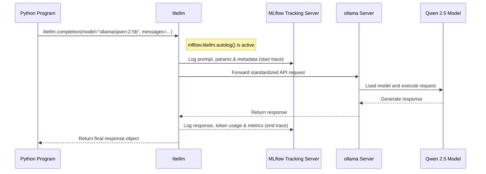
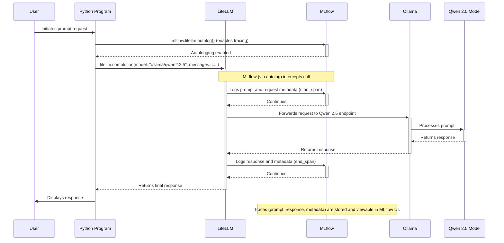

# MLflow

> Open source platform for the machine learning lifecycle

> [!NOTE]
> MLflow is an open-source platform, purpose-built to assist machine learning practitioners and teams in handling the complexities of the machine learning process. MLflow focuses on the full lifecycle for machine learning projects, ensuring that each phase is manageable, traceable, and reproducible
> MLflow 是一個開源平台，旨在幫助機器學習從業者和團隊處理機器學習流程的複雜性。 MLflow 專注於機器學習專案的整個生命週期，確保每個階段都可管理、可追溯且可重複。

- Git Repo
  - https://github.com/mlflow/mlflow
- Website
  - https://mlflow.org/
- Document
  - https://mlflow.org/docs/latest/

## 2025-06-05

- https://g.co/gemini/share/c59bcca08ee5

<table><tr><td>Q:</td><td>
<!-- add your Prompt bellow-->
Let's answer the following question one by one:

1. Could you give me a breif introduction of mlflow?
2. Can I integrate mlflow with ollama and litellm, especially to tracking user prompt go through litellm, mlflow, ollama to Qwen 2.5 model? If yes, can you give me an example?
3. Could you visualize the relationship between a Python program, litellm, mlflow, ollama, and Qwen 2.5 model using Mermaid.js sequence diagram syntax?
</td></tr><tr><td>A:</td><td>
<!-- add Chatbot Response bellow-->
Of course, here are the answers to your questions.

### 1. A Brief Introduction to MLflow

**MLflow** is a leading open-source platform designed to streamline the entire machine learning (ML) lifecycle. Think of it as a comprehensive toolkit for ML developers and MLOps engineers that helps manage the complexities of experimentation, reproducibility, deployment, and model management.

It is built on a library-agnostic and language-agnostic philosophy, meaning it can work with virtually any ML library (like Scikit-learn, TensorFlow, PyTorch) or programming language.

MLflow is organized into four primary components:

* **MLflow Tracking**: An API and UI for logging parameters, code versions, metrics, and output files when running your machine learning code. This allows for detailed comparison and visualization of different experiment runs.
* **MLflow Projects**: A standard format for packaging your reusable ML code. Each project is simply a directory with your code or a Git repository, making it easy to share and reproduce your workflows.
* **MLflow Models**: A conventional format for packaging machine learning models that can be used in a variety of downstream tools—for example, real-time serving through a REST API or batch inference on Apache Spark.
* **MLflow Model Registry**: A centralized model store, set of APIs, and UI to collaboratively manage the full lifecycle of an MLflow Model. It provides model lineage, versioning, and stage transitions (e.g., from "Staging" to "Production").
* **MLflow Tracing**: Specifically designed for Large Language Models (LLMs), this component helps you understand and debug the execution of your LLM applications by capturing detailed traces of your prompts, chains, and interactions with various LLM providers.

---

### 2. Integrating MLflow with `ollama` and `litellm`

**Yes, you can absolutely integrate MLflow with `litellm` and `ollama`** to track a user's prompt all the way to a locally-run model like Qwen 2.5.

This integration is made simple by MLflow's `autologging` features, particularly its integration with `litellm`. The process works like this:

1.  Your Python application uses **`litellm`** to make a call to an LLM. `litellm` acts as a unified interface, translating your request into the format required by the target model provider.
2.  You specify that the model is hosted by **`ollama`**. `litellm` knows how to communicate with the `ollama` server running on your machine.
3.  The `ollama` server receives the request and forwards it to the specified local model, in this case, **Qwen 2.5**.
4.  **MLflow's autologger** for `litellm` (`mlflow.litellm.autolog()`) automatically intercepts the `litellm` call. It logs all critical information—including the input prompt, the final response, model parameters, and performance metrics—to the MLflow Tracking server without you needing to write any manual logging code.

#### Example Implementation

Here is a Python code example demonstrating how to track a prompt through this entire stack.

**Prerequisites:**

* Ensure you have `ollama` installed and running.
* Pull the Qwen 2.5 model using the command: `ollama pull qwen:2.5b` (or another desired size).
* Install the necessary Python libraries:

    ```bash
    pip install mlflow litellm openai
    ```

**Python Script:**

```python
import mlflow
import litellm
import os

# 1. Configure MLflow to save logs locally
# This creates a 'mlruns' directory in your current folder.
mlflow.set_tracking_uri("file:./mlruns")

# 2. Set an experiment name to organize your runs
mlflow.set_experiment("Qwen 2.5 Chat Tracking")

# 3. Enable MLflow's automatic logging for litellm
# This is the key step that captures all the data.
mlflow.litellm.autolog()

# 4. Define the user's prompt
user_prompt = [
    {"role": "system", "content": "You are a helpful assistant."},
    {"role": "user", "content": "Explain the significance of the Qwen 2.5 model in 50 words or less."}
]

print("Sending prompt to Qwen 2.5 via litellm and ollama...")

# 5. Use litellm.completion to send the request
# The model name 'ollama/qwen:2.5b' tells litellm to use the 'qwen:2.5b' model from the local ollama server.
try:
    response = litellm.completion(
        model="ollama/qwen:2.5b", 
        messages=user_prompt,
        max_tokens=100,
        temperature=0.7
    )

    # 6. Print the response from the model
    assistant_response = response.choices[0].message.content
    print("\nModel Response:")
    print(assistant_response)

except Exception as e:
    print(f"An error occurred: {e}")

print("\nPrompt and response have been logged to MLflow.")
print("To view the UI, run 'mlflow ui' in your terminal.")
```

After running this script, you can launch the MLflow UI by executing `mlflow ui` in your terminal. Navigate to the "Qwen 2.5 Chat Tracking" experiment to see a detailed trace of your request, including the prompt, the model's response, token usage, and execution time.


---

### 3. Mermaid.js Sequence Diagram

Here is a Mermaid.js sequence diagram that visualizes the interaction between the components.


</td></tr></table>



## 2025-06-06

### MLflow AI Gateway

- https://mlflow.org/docs/latest/llms/deployments/

### Getting Started with MLflow Deployments for LLMs

- https://mlflow.org/docs/latest/llms/deployments/guides

### MLflow Authentication REST API

- https://mlflow.org/docs/latest/api_reference/auth/rest-api.html

### Command-Line Interface

- https://mlflow.org/docs/latest/api_reference/cli.html
- [Manage the MLflow Gateway service
Manage the MLflow Gateway service](https://mlflow.org/docs/latest/api_reference/cli.html?highlight=gateway#cmdoption-mlflow-gateway-start-config-path)
```bash
mlflow gateway start [OPTIONS]
```

## 2025-06-11

- 2023-08-25: 【How-to Guides】GCP Solution Practice - MLflow
  - https://medium.com/@kellenjohn175/how-to-guides-gcp-solution-practice-mlflow-1f5c6099c6af
