# pipdeptree

- PyPI
  - https://pypi.org/project/pipdeptree/
- Git Repo
  - https://github.com/tox-dev/pipdeptree

## 2025-04-17

- ( 2025-04-17 12:07:32 )
- 安裝:
  - 在 Git Bash 裡面測試 -- 因為 Git Bash 環境會無法正確編譯 chromadb 所以裝起來也沒辦法跑 `pipdeptree -p chromadb --mermaid`
  ```bash
  jazzw@JazzBook:~/git/snippet$ pip install pipdeptree
  ```
  - 在 WSL 裡面測
  ```bash
  jazz@JazzBook:/mnt/c/Users/jazzw/git/snippet$ pip install pipdeptree --break-system-package
  jazz@JazzBook:/mnt/c/Users/jazzw/git/snippet$ pipdeptree -p chromadb --mermaid
Warning!!! Duplicate package metadata found:
"/usr/lib/python3/dist-packages"
  cryptography                     41.0.7           (using 41.0.7, "/usr/lib/python3/dist-packages")
  typing_extensions                4.10.0           (using 4.13.2, "/home/jazz/.local/lib/python3.12/site-packages")
  jsonpatch                        1.32             (using 1.33, "/home/jazz/.local/lib/python3.12/site-packages")
  packaging                        24.0             (using 24.2, "/home/jazz/.local/lib/python3.12/site-packages")
  jsonschema                       4.10.3           (using 4.23.0, "/home/jazz/.local/lib/python3.12/site-packages")
  bcrypt                           3.2.2            (using 4.3.0, "/home/jazz/.local/lib/python3.12/site-packages")
  click                            8.1.6            (using 8.1.8, "/home/jazz/.local/lib/python3.12/site-packages")
  pip                              24.0             (using 25.0.1, "/home/jazz/.local/lib/python3.12/site-packages")
  certifi                          2023.11.17       (using 2025.1.31, "/home/jazz/.local/lib/python3.12/site-packages")
NOTE: This warning isn't a failure warning.
------------------------------------------------------------------------
  ```
- 備註：用 `uv tool install pipdeptree` 會找不到指定的套件。看來要有 pip 安裝的套件才有辦法跑出結果。
```
jazzw@JazzBook:~/git/snippet$ pipdeptree -p chromadb --mermaid > test.mermaid
No packages matched using the following patterns: chromadb
```
- 在 Github Codespace 安裝
  - 發現 `pipdeptree` 支援 `mermaid`
  ```
  @jazzwang ➜ /workspaces/codespaces-blank (main) $ pipdeptree -h
  usage: pipdeptree [-h] [-v] [-w [{silence,suppress,fail}]] [--python PYTHON] [--path PATH] [-p P] [-e P] [-l | -u] [-f] [--encoding E] [-a] [-d D] [-r] [--license] [-j | --json-tree | --mermaid | --graph-output FMT]

  Dependency tree of the installed python packages

  options:
    -h, --help          show this help message and exit
    -v, --version       show program's version number and exit
    -w [{silence,suppress,fail}], --warn [{silence,suppress,fail}]
                        warning control: suppress will show warnings but return 0 whether or not they are present; silence will not show warnings at all and always return 0; fail will show warnings and return 1 if any are present (default:
                        suppress)

  select:
    choose what to render

    --python PYTHON     Python interpreter to inspect. With "auto", it attempts to detect your virtual environment and fails if it can't. (default: /usr/local/python/3.12.1/bin/python3)
    --path PATH         Passes a path used to restrict where packages should be looked for (can be used multiple times) (default: None)
    -p P, --packages P  comma separated list of packages to show - wildcards are supported, like 'somepackage.*' (default: None)
    -e P, --exclude P   comma separated list of packages to not show - wildcards are supported, like 'somepackage.*'. (cannot combine with -p or -a) (default: None)
    -l, --local-only    if in a virtualenv that has global access do not show globally installed packages (default: False)
    -u, --user-only     only show installations in the user site dir (default: False)

  render:
    choose how to render the dependency tree (by default will use text mode)

    -f, --freeze        print names so as to write freeze files (default: False)
    --encoding E        the encoding to use when writing to the output (default: utf-8)
    -a, --all           list all deps at top level (text and freeze render only) (default: False)
    -d D, --depth D     limit the depth of the tree (text and freeze render only) (default: inf)
    -r, --reverse       render the dependency tree in the reverse fashion ie. the sub-dependencies are listed with the list of packages that need them under them (default: False)
    --license           list the license(s) of a package (text render only) (default: False)
    -j, --json          raw JSON - this will yield output that may be used by external tools (default: False)
    --json-tree         nested JSON - mimics the text format layout (default: False)
    --mermaid           https://mermaid.js.org flow diagram (default: False)
    --graph-output FMT  Graphviz rendering with the value being the graphviz output e.g.: dot, jpeg, pdf, png, svg (default: None)
  ```
  - 拿 `chromadb` 套件來產生 `mermaid` 語法的圖
  ```bash
  @jazzwang ➜ /workspaces/codespaces-blank (main) $ pipdeptree -p chromadb --mermaid
  flowchart TD
      classDef missing stroke-dasharray: 5

  (... skip ...)
  ```
- 將結果微調一下 `flowchart TD` 成 `flowchart LR`，方便呈現如下：

```mermaid
flowchart LR
    classDef missing stroke-dasharray: 5
    annotated-types["annotated-types\n0.7.0"]
    anyio["anyio\n4.9.0"]
    asgiref["asgiref\n3.8.1"]
    attrs["attrs\n25.3.0"]
    backoff["backoff\n2.2.1"]
    bcrypt["bcrypt\n4.3.0"]
    build["build\n1.2.2.post1"]
    cachetools["cachetools\n5.5.2"]
    certifi["certifi\n2025.1.31"]
    charset-normalizer["charset-normalizer\n3.4.1"]
    chroma-hnswlib["chroma-hnswlib\n0.7.6"]
    chromadb["chromadb\n1.0.4"]
    click_0["click\n8.1.8"]
    coloredlogs["coloredlogs\n15.0.1"]
    deprecated["Deprecated\n1.2.18"]
    distro["distro\n1.9.0"]
    durationpy["durationpy\n0.9"]
    fastapi["fastapi\n0.115.9"]
    filelock["filelock\n3.13.1"]
    flatbuffers["flatbuffers\n25.2.10"]
    fsspec["fsspec\n2024.6.1"]
    google-auth["google-auth\n2.39.0"]
    googleapis-common-protos["googleapis-common-protos\n1.70.0"]
    grpcio["grpcio\n1.71.0"]
    h11["h11\n0.14.0"]
    httpcore["httpcore\n1.0.7"]
    httpx["httpx\n0.28.1"]
    huggingface-hub["huggingface-hub\n0.30.2"]
    humanfriendly["humanfriendly\n10.0"]
    idna["idna\n3.10"]
    importlib-metadata["importlib_metadata\n8.6.1"]
    importlib-resources["importlib_resources\n6.5.2"]
    jsonschema-specifications["jsonschema-specifications\n2024.10.1"]
    jsonschema["jsonschema\n4.23.0"]
    kubernetes["kubernetes\n32.0.1"]
    markdown-it-py["markdown-it-py\n3.0.0"]
    mdurl["mdurl\n0.1.2"]
    mmh3["mmh3\n5.1.0"]
    monotonic["monotonic\n1.6"]
    mpmath["mpmath\n1.3.0"]
    numpy["numpy\n2.2.4"]
    oauthlib["oauthlib\n3.2.2"]
    onnxruntime["onnxruntime\n1.21.0"]
    opentelemetry-api["opentelemetry-api\n1.32.0"]
    opentelemetry-exporter-otlp-proto-common["opentelemetry-exporter-otlp-proto-common\n1.32.0"]
    opentelemetry-exporter-otlp-proto-grpc["opentelemetry-exporter-otlp-proto-grpc\n1.32.0"]
    opentelemetry-instrumentation-asgi["opentelemetry-instrumentation-asgi\n0.53b0"]
    opentelemetry-instrumentation-fastapi["opentelemetry-instrumentation-fastapi\n0.53b0"]
    opentelemetry-instrumentation["opentelemetry-instrumentation\n0.53b0"]
    opentelemetry-proto["opentelemetry-proto\n1.32.0"]
    opentelemetry-sdk["opentelemetry-sdk\n1.32.0"]
    opentelemetry-semantic-conventions["opentelemetry-semantic-conventions\n0.53b0"]
    opentelemetry-util-http["opentelemetry-util-http\n0.53b0"]
    orjson["orjson\n3.10.16"]
    overrides["overrides\n7.7.0"]
    packaging["packaging\n24.2"]
    posthog["posthog\n3.24.1"]
    protobuf["protobuf\n5.29.4"]
    pyasn1-modules["pyasn1_modules\n0.4.2"]
    pyasn1["pyasn1\n0.6.1"]
    pydantic-core["pydantic_core\n2.33.1"]
    pydantic["pydantic\n2.11.3"]
    pygments["Pygments\n2.19.1"]
    pypika["PyPika\n0.48.9"]
    pyproject-hooks["pyproject_hooks\n1.2.0"]
    python-dateutil["python-dateutil\n2.9.0.post0"]
    pyyaml["PyYAML\n6.0.2"]
    referencing["referencing\n0.36.2"]
    requests-oauthlib["requests-oauthlib\n2.0.0"]
    requests["requests\n2.32.3"]
    rich["rich\n14.0.0"]
    rpds-py["rpds-py\n0.23.1"]
    rsa["rsa\n4.9"]
    shellingham["shellingham\n1.5.4"]
    six["six\n1.17.0"]
    sniffio["sniffio\n1.3.1"]
    starlette["starlette\n0.45.3"]
    sympy["sympy\n1.13.1"]
    tenacity["tenacity\n9.1.2"]
    tokenizers["tokenizers\n0.21.1"]
    tqdm["tqdm\n4.67.1"]
    typer["typer\n0.15.2"]
    typing-extensions["typing_extensions\n4.12.2"]
    typing-inspection["typing-inspection\n0.4.0"]
    urllib3["urllib3\n2.3.0"]
    uvicorn["uvicorn\n0.34.1"]
    websocket-client["websocket-client\n1.8.0"]
    wrapt["wrapt\n1.17.2"]
    zipp["zipp\n3.21.0"]
    anyio -- ">=1.1" --> sniffio
    anyio -- ">=2.8" --> idna
    anyio -- ">=4.5" --> typing-extensions
    build -- ">=19.1" --> packaging
    build -- "any" --> pyproject-hooks
    chroma-hnswlib -- "any" --> numpy
    chromadb -- "==0.115.9" --> fastapi
    chromadb -- "==0.7.6" --> chroma-hnswlib
    chromadb -- ">=0.13.2" --> tokenizers
    chromadb -- ">=0.18.3" --> uvicorn
    chromadb -- ">=0.27.0" --> httpx
    chromadb -- ">=0.41b0" --> opentelemetry-instrumentation-fastapi
    chromadb -- ">=0.48.9" --> pypika
    chromadb -- ">=0.9.0" --> typer
    chromadb -- ">=1.0.3" --> build
    chromadb -- ">=1.14.1" --> onnxruntime
    chromadb -- ">=1.2.0" --> opentelemetry-api
    chromadb -- ">=1.2.0" --> opentelemetry-exporter-otlp-proto-grpc
    chromadb -- ">=1.2.0" --> opentelemetry-sdk
    chromadb -- ">=1.22.5" --> numpy
    chromadb -- ">=1.58.0" --> grpcio
    chromadb -- ">=1.9" --> pydantic
    chromadb -- ">=10.11.0" --> rich
    chromadb -- ">=2.4.0" --> posthog
    chromadb -- ">=28.1.0" --> kubernetes
    chromadb -- ">=3.9.12" --> orjson
    chromadb -- ">=4.0.1" --> bcrypt
    chromadb -- ">=4.0.1" --> mmh3
    chromadb -- ">=4.19.0" --> jsonschema
    chromadb -- ">=4.5.0" --> typing-extensions
    chromadb -- ">=4.65.0" --> tqdm
    chromadb -- ">=6.0.0" --> pyyaml
    chromadb -- ">=7.3.1" --> overrides
    chromadb -- ">=8.2.3" --> tenacity
    chromadb -- "any" --> importlib-resources
    coloredlogs -- ">=9.1" --> humanfriendly
    deprecated -- ">=1.10,<2" --> wrapt
    fastapi -- ">=0.40.0,<0.46.0" --> starlette
    fastapi -- ">=1.7.4,<3.0.0,!=2.1.0,!=2.0.1,!=2.0.0,!=1.8.1,!=1.8" --> pydantic
    fastapi -- ">=4.8.0" --> typing-extensions
    google-auth -- ">=0.2.1" --> pyasn1-modules
    google-auth -- ">=2.0.0,<6.0" --> cachetools
    google-auth -- ">=3.1.4,<5" --> rsa
    googleapis-common-protos -- ">=3.20.2,<7.0.0,!=4.21.5,!=4.21.4,!=4.21.3,!=4.21.2,!=4.21.1" --> protobuf
    httpcore -- ">=0.13,<0.15" --> h11
    httpcore -- "any" --> certifi
    httpx -- "==1.*" --> httpcore
    httpx -- "any" --> anyio
    httpx -- "any" --> certifi
    httpx -- "any" --> idna
    huggingface-hub -- ">=20.9" --> packaging
    huggingface-hub -- ">=2023.5.0" --> fsspec
    huggingface-hub -- ">=3.7.4.3" --> typing-extensions
    huggingface-hub -- ">=4.42.1" --> tqdm
    huggingface-hub -- ">=5.1" --> pyyaml
    huggingface-hub -- "any" --> filelock
    huggingface-hub -- "any" --> requests
    importlib-metadata -- ">=3.20" --> zipp
    jsonschema -- ">=0.28.4" --> referencing
    jsonschema -- ">=0.7.1" --> rpds-py
    jsonschema -- ">=2023.03.6" --> jsonschema-specifications
    jsonschema -- ">=22.2.0" --> attrs
    jsonschema-specifications -- ">=0.31.0" --> referencing
    kubernetes -- ">=0.32.0,!=0.42.*,!=0.41.*,!=0.40.0" --> websocket-client
    kubernetes -- ">=0.7" --> durationpy
    kubernetes -- ">=1.0.1" --> google-auth
    kubernetes -- ">=1.24.2" --> urllib3
    kubernetes -- ">=1.9.0" --> six
    kubernetes -- ">=14.05.14" --> certifi
    kubernetes -- ">=2.5.3" --> python-dateutil
    kubernetes -- ">=3.2.2" --> oauthlib
    kubernetes -- ">=5.4.1" --> pyyaml
    kubernetes -- "any" --> requests
    kubernetes -- "any" --> requests-oauthlib
    markdown-it-py -- "~=0.1" --> mdurl
    onnxruntime -- ">=1.21.6" --> numpy
    onnxruntime -- "any" --> coloredlogs
    onnxruntime -- "any" --> flatbuffers
    onnxruntime -- "any" --> packaging
    onnxruntime -- "any" --> protobuf
    onnxruntime -- "any" --> sympy
    opentelemetry-api -- ">=1.2.6" --> deprecated
    opentelemetry-api -- ">=6.0,<8.7.0" --> importlib-metadata
    opentelemetry-exporter-otlp-proto-common -- "==1.32.0" --> opentelemetry-proto
    opentelemetry-exporter-otlp-proto-grpc -- "==1.32.0" --> opentelemetry-exporter-otlp-proto-common
    opentelemetry-exporter-otlp-proto-grpc -- "==1.32.0" --> opentelemetry-proto
    opentelemetry-exporter-otlp-proto-grpc -- ">=1.2.6" --> deprecated
    opentelemetry-exporter-otlp-proto-grpc -- ">=1.63.2,<2.0.0" --> grpcio
    opentelemetry-exporter-otlp-proto-grpc -- "~=1.15" --> opentelemetry-api
    opentelemetry-exporter-otlp-proto-grpc -- "~=1.32.0" --> opentelemetry-sdk
    opentelemetry-exporter-otlp-proto-grpc -- "~=1.52" --> googleapis-common-protos
    opentelemetry-instrumentation -- "==0.53b0" --> opentelemetry-semantic-conventions
    opentelemetry-instrumentation -- ">=1.0.0,<2.0.0" --> wrapt
    opentelemetry-instrumentation -- ">=18.0" --> packaging
    opentelemetry-instrumentation -- "~=1.4" --> opentelemetry-api
    opentelemetry-instrumentation-asgi -- "==0.53b0" --> opentelemetry-instrumentation
    opentelemetry-instrumentation-asgi -- "==0.53b0" --> opentelemetry-semantic-conventions
    opentelemetry-instrumentation-asgi -- "==0.53b0" --> opentelemetry-util-http
    opentelemetry-instrumentation-asgi -- "~=1.12" --> opentelemetry-api
    opentelemetry-instrumentation-asgi -- "~=3.0" --> asgiref
    opentelemetry-instrumentation-fastapi -- "==0.53b0" --> opentelemetry-instrumentation
    opentelemetry-instrumentation-fastapi -- "==0.53b0" --> opentelemetry-instrumentation-asgi
    opentelemetry-instrumentation-fastapi -- "==0.53b0" --> opentelemetry-semantic-conventions
    opentelemetry-instrumentation-fastapi -- "==0.53b0" --> opentelemetry-util-http
    opentelemetry-instrumentation-fastapi -- "~=1.12" --> opentelemetry-api
    opentelemetry-proto -- ">=5.0,<6.0" --> protobuf
    opentelemetry-sdk -- "==0.53b0" --> opentelemetry-semantic-conventions
    opentelemetry-sdk -- "==1.32.0" --> opentelemetry-api
    opentelemetry-sdk -- ">=3.7.4" --> typing-extensions
    opentelemetry-semantic-conventions -- "==1.32.0" --> opentelemetry-api
    opentelemetry-semantic-conventions -- ">=1.2.6" --> deprecated
    posthog -- ">2.1" --> python-dateutil
    posthog -- ">=1.10.0" --> backoff
    posthog -- ">=1.5" --> monotonic
    posthog -- ">=1.5" --> six
    posthog -- ">=1.5.0" --> distro
    posthog -- ">=2.7,<3.0" --> requests
    pyasn1-modules -- ">=0.6.1,<0.7.0" --> pyasn1
    pydantic -- "==2.33.1" --> pydantic-core
    pydantic -- ">=0.4.0" --> typing-inspection
    pydantic -- ">=0.6.0" --> annotated-types
    pydantic -- ">=4.12.2" --> typing-extensions
    pydantic-core -- ">=4.6.0,!=4.7.0" --> typing-extensions
    python-dateutil -- ">=1.5" --> six
    referencing -- ">=0.7.0" --> rpds-py
    referencing -- ">=22.2.0" --> attrs
    referencing -- ">=4.4.0" --> typing-extensions
    requests -- ">=1.21.1,<3" --> urllib3
    requests -- ">=2,<4" --> charset-normalizer
    requests -- ">=2.5,<4" --> idna
    requests -- ">=2017.4.17" --> certifi
    requests-oauthlib -- ">=2.0.0" --> requests
    requests-oauthlib -- ">=3.0.0" --> oauthlib
    rich -- ">=2.13.0,<3.0.0" --> pygments
    rich -- ">=2.2.0" --> markdown-it-py
    rsa -- ">=0.1.3" --> pyasn1
    starlette -- ">=3.6.2,<5" --> anyio
    sympy -- ">=1.1.0,<1.4" --> mpmath
    tokenizers -- ">=0.16.4,<1.0" --> huggingface-hub
    typer -- ">=1.3.0" --> shellingham
    typer -- ">=10.11.0" --> rich
    typer -- ">=3.7.4.3" --> typing-extensions
    typer -- ">=8.0.0" --> click_0
    typing-inspection -- ">=4.12.0" --> typing-extensions
    uvicorn -- ">=0.8" --> h11
    uvicorn -- ">=7.0" --> click_0
```
