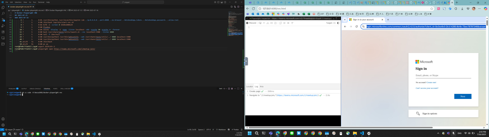

# Docker Playwright VNC

- https://github.com/Booza1981/docker-playwright-vnc

## 2025-07-14

- 緣起：
  - 需要「分身」來跑 MS Teams Live Caption 的 JavaScript
  - 希望可以「多重影分身」，所以把腦筋動到 Playwright 跟 Github Codespaces 身上，這樣就可以透過預先儲存的 Browser Profile 跟登入過的 local storage 來自動化開啟 Live Caption 並且儲存下來。甚至也可以寫成 Github Actions 來排程想紀錄的會議。
- 搜尋：
  - 找到 https://github.com/Booza1981/docker-playwright-vnc 似乎可以滿足部份需求，所以實測一下。

## 2025-07-15

- ( 2025-07-15 22:23:02 )
- 實測：
```bash
~/git/snippet$ gh cs create -R Booza1981/docker-playwright-vnc
  ✓ Codespaces usage for this repository is paid for by jazzwang
? Choose Machine Type: 2 cores, 8 GB RAM, 32 GB storage
probable-trout-r47j4v44r3p7x9
~/git/snippet$ gh cs ssh -R Booza1981/docker-playwright-vnc
Welcome to Ubuntu 24.04.2 LTS (GNU/Linux 6.8.0-1027-azure x86_64)

 * Documentation:  https://help.ubuntu.com
 * Management:     https://landscape.canonical.com
 * Support:        https://ubuntu.com/pro

The programs included with the Ubuntu system are free software;
the exact distribution terms for each program are described in the
individual files in /usr/share/doc/*/copyright.

Ubuntu comes with ABSOLUTELY NO WARRANTY, to the extent permitted by
applicable law.

@jazzwang ➜ /workspaces/docker-playwright-vnc (main) $
@jazzwang ➜ /workspaces/docker-playwright-vnc (main) $ ./build.sh
Removing previous container...
Building Docker image for Playwright VNC...
[+] Building 0.4s (14/14) FINISHED
Starting container...
137fa366f758e15ba37182a95dea9a3450da20a41f2242df0ff009ba7cb9d54e

Container started successfully!
------------------------------------------------
You can access:
  - VNC: localhost:5900
  - noVNC Web Interface: http://localhost:6080
  - Jupyter Lab: http://localhost:8888

To check container logs:
  docker logs playwright-vnc

To stop and remove the container:
  docker stop playwright-vnc
  docker rm playwright-vnc
------------------------------------------------
```
- 結果：用 VS Code 會比較方便把 port 轉出來
```bash
~/git/snippet$ gh cs code -R Booza1981/docker-playwright-vnc
```
- [](2025-07-15_docker-playwright-vnc.png)

## 2025-07-16

- 在 Codespace 裡重新啟動 docker instance
```bash
@jazzwang ➜ /workspaces/docker-playwright-vnc (main) $ docker-compose up -d
[+] Running 1/1
 ✔ Container playwright-vnc  Started
@jazzwang ➜ /workspaces/docker-playwright-vnc (main) $ docker-compose ps
WARN[0000] /workspaces/docker-playwright-vnc/docker-compose.yml: the attribute `version` is obsolete, it will be ignored, please remove it to avoid potential confusion
NAME             IMAGE                                  COMMAND                  SERVICE          CREATED         STATUS         PORTS
playwright-vnc   docker-playwright-vnc-playwright-vnc   "/usr/bin/supervisor…"   playwright-vnc   5 minutes ago   Up 5 minutes   0.0.0.0:5900->5900/tcp, [::]:5900->5900/tcp, 0.0.0.0:6080->6080/tcp, [::]:6080->6080/tcp, 0.0.0.0:8888->8888/tcp, [::]:8888->8888/tcp
@jazzwang ➜ /workspaces/docker-playwright-vnc (main) $ docker exec -it playwright-vnc /bin/bash
root@fb8b77fa6927:/app# which playwright
/usr/local/bin/playwright
root@fb8b77fa6927:/app# ps ax
    PID TTY      STAT   TIME COMMAND
      1 ?        Ss     0:00 /usr/bin/python3 /usr/bin/supervisord -c /etc/supervisor/conf.d/supervisord.conf
      6 ?        S      0:01 /usr/bin/python /usr/local/bin/jupyter-lab --ip=0.0.0.0 --port=8888 --no-browser --NotebookApp.token= --NotebookApp.password= --allow-root
      7 ?        S      0:00 /bin/bash /opt/bin/start-vnc.sh
      8 ?        S      0:02 Xvfb :1 -screen 0 1920x1080x24
      9 ?        S      0:00 fluxbox
     10 ?        S      0:04 x11vnc -display :1 -nopw -listen localhost -xkb -ncache 10 -ncache_cr -forever
     11 ?        S      0:00 bash /usr/share/novnc/utils/launch.sh --vnc localhost:5900 --listen 6080
     12 ?        S      0:00 tail -f /dev/null
     24 ?        S      0:00 /usr/bin/python3 /usr/bin/websockify --web /usr/share/novnc/utils/../ 6080 localhost:5900
     40 ?        S      0:00 /usr/bin/python3 /usr/bin/websockify --web /usr/share/novnc/utils/../ 6080 localhost:5900
     41 pts/0    Ss     0:00 /bin/bash
     50 pts/0    R+     0:00 ps ax
root@fb8b77fa6927:/app# export DISPLAY=:1
root@fb8b77fa6927:/app# playwright open https://teams.microsoft.com/l/meetup-join/
```
- ( 2025-07-16 14:49:41 )
- 

## 2025-07-22

- ( 2025-07-22 09:35:50 )
- 在 VPS 實測時，遇到以下錯誤：
```bash
jazz@docker:~$ git clone https://github.com/Booza1981/docker-playwright-vnc
jazz@docker:~$ cd docker-playwright-vnc/
jazz@docker:~/docker-playwright-vnc$ ./build.sh
Building Docker image for Playwright VNC...
Sending build context to Docker daemon    214kB
Step 1/13 : FROM mcr.microsoft.com/playwright/python:latest
 ---> ac62c0245bf9
Step 2/13 : ENV DEBIAN_FRONTEND noninteractive
 ---> Running in 6e24d6f34178
 ---> 95b26580a653
Removing intermediate container 6e24d6f34178
Step 3/13 : ENV DISPLAY :1
 ---> Running in 6c9c94fe1230
 ---> 3fb756dc925d
Removing intermediate container 6c9c94fe1230
Step 4/13 : RUN apt-get update && apt-get install -y --no-install-recommends     xvfb     x11vnc     fluxbox     wget     python3-pip     python3-notebook     jupyter     nano     dbus-x11     net-tools     novnc     supervisor     && apt-get clean     && rm -rf /var/lib/apt/lists/*
 ---> Running in a7c56e3130f7
Get:1 http://archive.ubuntu.com/ubuntu jammy InRelease [270 kB]
Get:2 http://security.ubuntu.com/ubuntu jammy-security InRelease [129 kB]
Err:1 http://archive.ubuntu.com/ubuntu jammy InRelease
  The following signatures couldn't be verified because the public key is not available: NO_PUBKEY 871920D1991BC93C
Get:3 http://archive.ubuntu.com/ubuntu jammy-updates InRelease [128 kB]
Err:2 http://security.ubuntu.com/ubuntu jammy-security InRelease
  The following signatures couldn't be verified because the public key is not available: NO_PUBKEY 871920D1991BC93C
Get:4 http://archive.ubuntu.com/ubuntu jammy-backports InRelease [127 kB]
Err:3 http://archive.ubuntu.com/ubuntu jammy-updates InRelease
  The following signatures couldn't be verified because the public key is not available: NO_PUBKEY 871920D1991BC93C
Err:4 http://archive.ubuntu.com/ubuntu jammy-backports InRelease
  The following signatures couldn't be verified because the public key is not available: NO_PUBKEY 871920D1991BC93C
Reading package lists...
W: http://archive.ubuntu.com/ubuntu/dists/jammy/InRelease: The key(s) in the keyring /etc/apt/trusted.gpg.d/ubuntu-keyring-2012-cdimage.gpg are ignored as the file is not readable by user '_apt' executing apt-key.
W: http://archive.ubuntu.com/ubuntu/dists/jammy/InRelease: The key(s) in the keyring /etc/apt/trusted.gpg.d/ubuntu-keyring-2018-archive.gpg are ignored as the file is not readable by user '_apt' executing apt-key.
W: GPG error: http://archive.ubuntu.com/ubuntu jammy InRelease: The following signatures couldn't be verified because the public key is not available: NO_PUBKEY 871920D1991BC93C
E: The repository 'http://archive.ubuntu.com/ubuntu jammy InRelease' is not signed.
W: http://security.ubuntu.com/ubuntu/dists/jammy-security/InRelease: The key(s) in the keyring /etc/apt/trusted.gpg.d/ubuntu-keyring-2012-cdimage.gpg are ignored as the file is not readable by user '_apt' executing apt-key.
W: http://security.ubuntu.com/ubuntu/dists/jammy-security/InRelease: The key(s) in the keyring /etc/apt/trusted.gpg.d/ubuntu-keyring-2018-archive.gpg are ignored as the file is not readable by user '_apt' executing apt-key.
W: GPG error: http://security.ubuntu.com/ubuntu jammy-security InRelease: The following signatures couldn't be verified because the public key is not available: NO_PUBKEY 871920D1991BC93C
E: The repository 'http://security.ubuntu.com/ubuntu jammy-security InRelease' is not signed.
W: http://archive.ubuntu.com/ubuntu/dists/jammy-updates/InRelease: The key(s) in the keyring /etc/apt/trusted.gpg.d/ubuntu-keyring-2012-cdimage.gpg are ignored as the file is not readable by user '_apt' executing apt-key.
W: http://archive.ubuntu.com/ubuntu/dists/jammy-updates/InRelease: The key(s) in the keyring /etc/apt/trusted.gpg.d/ubuntu-keyring-2018-archive.gpg are ignored as the file is not readable by user '_apt' executing apt-key.
W: GPG error: http://archive.ubuntu.com/ubuntu jammy-updates InRelease: The following signatures couldn't be verified because the public key is not available: NO_PUBKEY 871920D1991BC93C
E: The repository 'http://archive.ubuntu.com/ubuntu jammy-updates InRelease' is not signed.
W: http://archive.ubuntu.com/ubuntu/dists/jammy-backports/InRelease: The key(s) in the keyring /etc/apt/trusted.gpg.d/ubuntu-keyring-2012-cdimage.gpg are ignored as the file is not readable by user '_apt' executing apt-key.
W: http://archive.ubuntu.com/ubuntu/dists/jammy-backports/InRelease: The key(s) in the keyring /etc/apt/trusted.gpg.d/ubuntu-keyring-2018-archive.gpg are ignored as the file is not readable by user '_apt' executing apt-key.
W: GPG error: http://archive.ubuntu.com/ubuntu jammy-backports InRelease: The following signatures couldn't be verified because the public key is not available: NO_PUBKEY 871920D1991BC93C
E: The repository 'http://archive.ubuntu.com/ubuntu jammy-backports InRelease' is not signed.
E: Problem executing scripts APT::Update::Post-Invoke 'rm -f /var/cache/apt/archives/*.deb /var/cache/apt/archives/partial/*.deb /var/cache/apt/*.bin || true'
E: Sub-process returned an error code
The command '/bin/sh -c apt-get update && apt-get install -y --no-install-recommends     xvfb     x11vnc     fluxbox     wget     python3-pip     python3-notebook     jupyter     nano     dbus-x11     net-tools     novnc     supervisor     && apt-get clean     && rm -rf /var/lib/apt/lists/*' returned a non-zero code: 100
Starting container...
Unable to find image 'playwright-vnc:latest' locally
docker: Error response from daemon: pull access denied for playwright-vnc, repository does not exist or may require 'docker login'.
See 'docker run --help'.

Container started successfully!
------------------------------------------------
You can access:
  - VNC: localhost:5900
  - noVNC Web Interface: http://localhost:6080
  - Jupyter Lab: http://localhost:8888

To check container logs:
  docker logs playwright-vnc

To stop and remove the container:
  docker stop playwright-vnc
  docker rm playwright-vnc
------------------------------------------------
```
- 看起來是 APT Repo 的 GPG public key 問題，有點怪，上週測試都正常。

<table><tr><td>Q:</td><td>
<!-- add your Prompt bellow-->
how to resolve this error?

W: http://security.ubuntu.com/ubuntu/dists/jammy-security/InRelease: The key(s) in the keyring /etc/apt/trusted.gpg.d/ubuntu-keyring-2012-cdimage.gpg are ignored as the file is not readable by user '_apt' executing apt-key.
</td></tr><tr><td>A:</td><td>
<!-- add Chatbot Response bellow-->
This error message: "W: [http://security.ubuntu.com/ubuntu/dists/jammy-security/InRelease](http://security.ubuntu.com/ubuntu/dists/jammy-security/InRelease): The key(s) in the keyring /etc/apt/trusted.gpg.d/ubuntu-keyring-2012-cdimage.gpg are ignored as the file is not readable by user '\_apt' executing apt-key." indicates a permissions issue with a GPG key file used by `apt`. The `_apt` user, which `apt` runs as, doesn't have the necessary read permissions for that file.

Here's how to resolve it:

**The Recommended (Modern) Way: Handling apt-key Deprecation**

This error often appears alongside warnings about `apt-key` being deprecated. Ubuntu (especially 22.04 "Jammy" and newer) is moving away from storing keys in `/etc/apt/trusted.gpg` or `/etc/apt/trusted.gpg.d/` because keys in these locations are globally trusted for *all* repositories. The new, more secure method is to store keys in `/etc/apt/keyrings/` and reference them explicitly in your `sources.list` entries using `signed-by`.

While you might just fix the permissions, it's a good opportunity to adopt the recommended approach. Here's the general process:

1.  **Identify the problematic key:**
    The error message explicitly points to `/etc/apt/trusted.gpg.d/ubuntu-keyring-2012-cdimage.gpg`. This is an official Ubuntu key.

2.  **Ensure correct permissions for the keyrings directory:**
    The `_apt` user needs to be able to read files in `/etc/apt/keyrings/`.

    ```bash
    sudo mkdir -m 0755 -p /etc/apt/keyrings/
    sudo chmod 0755 /etc/apt/keyrings/
    ```

3.  **Correct the permissions for the specific key file (if you want to stick with the old method temporarily):**
    If you just want to get rid of the warning without fully migrating to the new key management system (though it's highly recommended to migrate), you can set the permissions of the file so `_apt` can read it.

    ```bash
    sudo chmod 644 /etc/apt/trusted.gpg.d/ubuntu-keyring-2012-cdimage.gpg
    ```

    This makes the file readable by all users, which is generally acceptable for public keys.

4.  **Update your `apt` sources:**
    After making changes, always run:

    ```bash
    sudo apt update
    ```

    This will re-evaluate your package sources and hopefully, the warning will be gone.

**Why the error occurs (permissions):**

The user `_apt` is a special system user that `apt` uses for its operations. If a GPG key file (which `apt` needs to verify the authenticity of packages) isn't readable by this user, then `apt` will ignore it, leading to the warning you see. This often happens due to incorrect file permissions or ownership.

**Important Note on `apt-key` and deprecation:**

Even if you fix the permissions, you might still see warnings like "Warning: apt-key is deprecated." This is a separate issue related to the long-term plan for `apt`'s key management. For official Ubuntu repositories, these keys are usually handled automatically. For third-party repositories, you'll eventually need to move towards the `signed-by` method in your `sources.list` files.

If you have other `apt-key` warnings for third-party repositories, you'll need to:

1.  Find the public key for that repository (usually from the repository's official documentation).
2.  Download it and place it in `/etc/apt/keyrings/` (using `curl` and `gpg --dearmor`).
3.  Modify the corresponding `sources.list.d/*.list` file to include `signed-by=/etc/apt/keyrings/your-key.gpg`.
4.  Remove the old key from `/etc/apt/trusted.gpg` or `/etc/apt/trusted.gpg.d/` using `sudo apt-key del <KEY_ID>`.

For the specific `ubuntu-keyring-2012-cdimage.gpg` file, simply correcting the permissions should be sufficient to resolve the warning, as it's an official Ubuntu key.
</td></tr></table>
