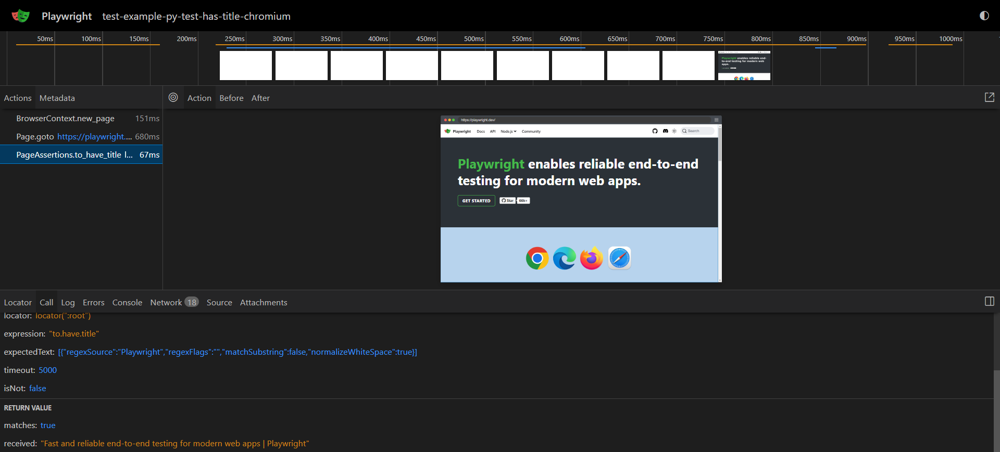

# playwright

> Playwright enables reliable end-to-end testing for modern web apps.

- https://playwright.dev/
  - https://playwright.dev/python/ - Python implementation
- Git Repo: https://github.com/microsoft/playwright

## 2024-11-03

- https://playwright.dev/python/docs/intro

### Installation

- 測試環境：Github Codespace
```bash
jazzw@JazzBook:~/git/snippet$ gh cs code
? Choose codespace: jazzwang/snippet (master*): snippet
```
- ( 2024-11-03 09:16:08 )
- 根據測試 JavaScript 版本的經驗，切到 `/tmp` 目錄做實驗：
```bash
@jazzwang ➜ /workspaces/snippet (master) $ cd /tmp/
@jazzwang ➜ /tmp $ pip install pytest-playwright
@jazzwang ➜ /tmp $ playwright install
@jazzwang ➜ /tmp $ 
@jazzwang ➜ /tmp $ cat > test_example.py << EOF
import re
from playwright.sync_api import Page, expect

def test_has_title(page: Page):
    page.goto("https://playwright.dev/")

    # Expect a title "to contain" a substring.
    expect(page).to_have_title(re.compile("Playwright"))

def test_get_started_link(page: Page):
    page.goto("https://playwright.dev/")

    # Click the get started link.
    page.get_by_role("link", name="Get started").click()

    # Expects page to have a heading with the name of Installation.
    expect(page.get_by_role("heading", name="Installation")).to_be_visible()
EOF
@jazzwang ➜ /tmp $ pytest
======================================================================== test session starts =========================================================================
platform linux -- Python 3.10.13, pytest-8.3.3, pluggy-1.5.0
rootdir: /tmp
plugins: anyio-4.3.0, playwright-0.5.2, base-url-2.1.0
collected 2 items                                                                                                                                                    

test_example.py 
..                                                                                                                                             [100%]

========================================================================= 2 passed in 8.94s ==========================================================================
```
- ( 2024-11-03 09:30:46 )
- 本來想找類似 `npx playwright show-report` 的指令，不過看樣子應該得看 `pytest` 的設計怎麼產生報表。初步在目錄裡沒有找到報告。
```bash
@jazzwang ➜ /tmp $ ls -al
total 36
drwxr-xrwt+ 4 root      root       4096 Nov  3 09:25 .
drwxr-xr-x  1 root      root       4096 Apr 14  2024 ..
drwxr-xr-x+ 3 codespace codespace  4096 Nov  3 09:22 .pytest_cache
drwxr-xrw-+ 2 codespace codespace  4096 Nov  3 09:22 __pycache__
-rw-r--rw-  1 root      root      10811 Nov  3 09:16 dockerd.log
-rw-r--rw-  1 root      root         57 Nov  3 09:16 sshd.log
-rw-r--rw-  1 codespace codespace   553 Nov  3 09:21 test_example.py
srwxr-xr--  1 codespace codespace     0 Nov  3 09:15 vscode-git-f83137f03e.sock
srwxr-xr--  1 codespace codespace     0 Nov  3 09:15 vscode-ipc-078b1a70-dc0c-4927-9c59-6b374b3ad1f3.sock
srwxr-xr--  1 codespace codespace     0 Nov  3 09:15 vscode-ipc-2e9633f1-c426-4ff8-b512-0493ed38de41.sock
```
- ( 2024-11-03 09:36:02 )
- 比較意外的是發現 `pytest-playwright` 提供的 command line `playwright` 居然就可以直接對網址做截圖。
```bash
@jazzwang ➜ /tmp $ playwright
Usage: playwright [options] [command]

Options:
  -V, --version                          output the version number
  -h, --help                             display help for command

Commands:
  open [options] [url]                   open page in browser specified via -b, --browser
  codegen [options] [url]                open page and generate code for user actions
  install [options] [browser...]         ensure browsers necessary for this version of Playwright are installed
  uninstall [options]                    Removes browsers used by this installation of Playwright from the system (chromium, firefox, webkit, ffmpeg). This
                                         does not include branded channels.
  install-deps [options] [browser...]    install dependencies necessary to run browsers (will ask for sudo permissions)
  cr [options] [url]                     open page in Chromium
  ff [options] [url]                     open page in Firefox
  wk [options] [url]                     open page in WebKit
  screenshot [options] <url> <filename>  capture a page screenshot
  pdf [options] <url> <filename>         save page as pdf
  show-trace [options] [trace...]        show trace viewer
  help [command]                         display help for command
```
- 這樣要拿來做 Github Action 的截圖就相對簡單許多。
  - 原本就想拿來取代 https://github.com/jazzwang/github-action-lab/actions/workflows/lunch-screenshot.yml 用的 https://github.com/marketplace/actions/screenshots-ci-action
```bash
@jazzwang ➜ /tmp $ playwright screenshot -h
Usage: playwright screenshot [options] <url> <filename>

capture a page screenshot

Options:
  --wait-for-selector <selector>  wait for selector before taking a screenshot
  --wait-for-timeout <timeout>    wait for timeout in milliseconds before taking a screenshot
  --full-page                     whether to take a full page screenshot (entire scrollable area)
  -b, --browser <browserType>     browser to use, one of cr, chromium, ff, firefox, wk, webkit (default: "chromium")
  --block-service-workers         block service workers
  --channel <channel>             Chromium distribution channel, "chrome", "chrome-beta", "msedge-dev", etc
  --color-scheme <scheme>         emulate preferred color scheme, "light" or "dark"
  --device <deviceName>           emulate device, for example  "iPhone 11"
  --geolocation <coordinates>     specify geolocation coordinates, for example "37.819722,-122.478611"
  --ignore-https-errors           ignore https errors
  --load-storage <filename>       load context storage state from the file, previously saved with --save-storage
  --lang <language>               specify language / locale, for example "en-GB"
  --proxy-server <proxy>          specify proxy server, for example "http://myproxy:3128" or "socks5://myproxy:8080"
  --proxy-bypass <bypass>         comma-separated domains to bypass proxy, for example ".com,chromium.org,.domain.com"
  --save-har <filename>           save HAR file with all network activity at the end
  --save-har-glob <glob pattern>  filter entries in the HAR by matching url against this glob pattern
  --save-storage <filename>       save context storage state at the end, for later use with --load-storage
  --timezone <time zone>          time zone to emulate, for example "Europe/Rome"
  --timeout <timeout>             timeout for Playwright actions in milliseconds, no timeout by default
  --user-agent <ua string>        specify user agent string
  --viewport-size <size>          specify browser viewport size in pixels, for example "1280, 720"
  -h, --help                      display help for command

Examples:

  $ screenshot -b webkit https://example.com example.png
```
- 在 Github Codespace 上會遇到 SSL 問題
```bash
@jazzwang ➜ /workspaces/snippet (master) $ playwright screenshot https://fatraceschool.k12ea.gov.tw/frontend/search.html?school=64736003 test.png
Navigating to https://fatraceschool.k12ea.gov.tw/frontend/search.html?school=64736003
Error: net::ERR_CONNECTION_CLOSED at https://fatraceschool.k12ea.gov.tw/frontend/search.html?school=64736003
Call log:
  - navigating to "https://fatraceschool.k12ea.gov.tw/frontend/search.html?school=64736003", waiting until "load"

@jazzwang ➜ /workspaces/snippet (master) $
@jazzwang ➜ /workspaces/snippet (master) $ curl https://fatraceschool.k12ea.gov.tw/frontend/search.html?school=64736003
curl: (35) OpenSSL SSL_connect: SSL_ERROR_SYSCALL in connection to fatraceschool.k12ea.gov.tw:443
```
- ( 2024-11-03 11:05:58 )
- 在 Windows 上測試 `playwright screenshot`
```bash
jazzw@JazzBook:~/git/github-action-lab$ pip install pytest-playwright
jazzw@JazzBook:~/git/github-action-lab$ playwright.exe install
jazzw@JazzBook:~/git/github-action-lab$ playwright.exe screenshot "https://fatraceschool.k12ea.gov.tw/frontend/search.html?school=64736003" 2024-11-03.png
```
- 結果：發現這個網站需要等 javascript 跑完才能截圖，否則結果不正確。


## 2024-11-05

### Trace View

- ( 2024-11-05 15:57:03 )
- https://playwright.dev/python/docs/trace-viewer-intro
- 原本想說要靠 `pytest-html` 來產生報表，不過剛好看到 CI 裡的指令用到 `pytest --tracing=retain-on-failure`，所以測試一下：
```yml
    - name: Run your tests
      run: pytest --tracing=retain-on-failure
```
- 測試環境：Github Codespace
- 測試腳本：參考上述文件裡的 `test_example.py`，然後用 `pytest --tracing on` 讓測試程式把過程存成 `trace.zip`
```bash
@jazzwang ➜ /tmp $ cat > test_example.py << EOF
> import re
> from playwright.sync_api import Page, expect
>
> def test_has_title(page: Page):
>     page.goto("https://playwright.dev/")
>
>     # Expect a title "to contain" a substring.
>     expect(page).to_have_title(re.compile("Playwright"))
>
> def test_get_started_link(page: Page):
>     page.goto("https://playwright.dev/")
>
>     # Click the get started link.
>     page.get_by_role("link", name="Get started").click()
>
>     # Expects page to have a heading with the name of Installation.
>     expect(page.get_by_role("heading", name="Installation")).to_be_visible()
> EOF

@jazzwang ➜ /tmp $ pytest --tracing on
=================================================================== test session starts ====================================================================
platform linux -- Python 3.10.13, pytest-8.3.3, pluggy-1.5.0
rootdir: /tmp
plugins: anyio-4.3.0, playwright-0.5.2, base-url-2.1.0
collected 2 items

test_example.py ..                                                                                                                                   [100%]

==================================================================== 2 passed in 2.81s =====================================================================

@jazzwang ➜ /tmp $ ls
__pycache__  dockerd.log  sshd.log  test-results  test_example.py

@jazzwang ➜ /tmp $ tree test-results/
test-results/
├── test-example-py-test-get-started-link-chromium
│   └── trace.zip
└── test-example-py-test-has-title-chromium
    └── trace.zip

2 directories, 2 files
```
- 如果要看 trace 的結果，可以用指令 `playwright show-trace trace.zip`
- https://playwright.dev/python/docs/trace-viewer-intro#opening-the-trace
- 

### Setting up CI

- https://playwright.dev/python/docs/ci-intro
- ( 2024-11-05 16:07:40 )
- 下載 Github Codespace 上產生的 `trace.zip`
```bash
jazzw@JazzBook:~/Downloads$ gh cs cp -e 'remote:/tmp/test-results/test-example-py-test-has-title-chromium/trace.zip' trace.zip
? Choose codespace: jazzwang/snippet (master*): snippet
trace.zip     
```
- 上傳到 https://trace.playwright.dev/
- 結果：看起來 `trace` 有一點像 HAR ，但可以呈現畫面 render 的時間點。
