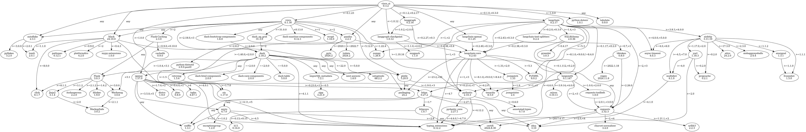

# Vizro

> Vizro is a low-code toolkit for building high-quality data visualization apps.

- Git Repo:
  - https://github.com/mckinsey/vizro
- Document:
  - https://vizro.readthedocs.io/en/stable/

## 2024-12-19

- Installation
  - Test with Github Codespace
```bash
@jazzwang ➜ /workspaces/snippet (master) $ pip install vizro
```
- Tutorial
```
@jazzwang ➜ /workspaces/snippet/py/vizro (master) $ cat > App.py << EOF
> import vizro.plotly.express as px
> from vizro import Vizro
> import vizro.models as vm
> 
> df = px.data.iris()
> 
> page = vm.Page(
>     title="My first dashboard",
>     components=[
>         vm.Graph(figure=px.scatter(df, x="sepal_length", y="petal_width", color="species")),
>         vm.Graph(figure=px.histogram(df, x="sepal_width", color="species")),
>     ],
>     controls=[
>         vm.Filter(column="species", selector=vm.Dropdown(value=["ALL"])),
>     ],
> )
> 
> dashboard = vm.Dashboard(pages=[page])
> Vizro().build(dashboard).run()
> EOF
@jazzwang ➜ /workspaces/snippet/py/vizro (master) $ python3 App.py 
Dash is running on http://127.0.0.1:8050/

INFO:dash.dash:Dash is running on http://127.0.0.1:8050/

 * Serving Flask app 'App'
 * Debug mode: off
INFO:werkzeug:WARNING: This is a development server. Do not use it in a production deployment. Use a production WSGI server instead.
 * Running on http://127.0.0.1:8050
INFO:werkzeug:Press CTRL+C to quit
INFO:werkzeug:127.0.0.1 - - [19/Dec/2024 11:44:57] "GET / HTTP/1.1" 200 -
INFO:werkzeug:127.0.0.1 - - [19/Dec/2024 11:44:57] "GET /_dash-component-suites/vizro/static/css/vizro-bootstrap.v0_1_30m1734579647.min.css HTTP/1.1" 200 -
... 略 ...

^C

@jazzwang ➜ /workspaces/snippet/py/vizro (master) $ git add App.py 
```

### Vizro-AI

- Source Code is under `vizro-ai` subfolder
  - https://github.com/mckinsey/vizro/tree/main/vizro-ai
- 安裝：
  - 預設是用 OpenAI API
```bash
@jazzwang ➜ /workspaces/snippet (master) $ pip3 install vizro_ai
```
```bash
@jazzwang ➜ /workspaces/snippet (master) $ pip3 show vizro_ai
Name: vizro_ai
Version: 0.3.2
Summary: Vizro-AI is a tool for generating data visualizations
Home-page: 
Author: Vizro Team
Author-email: 
License: 
Location: /usr/local/python/3.10.13/lib/python3.10/site-packages
Requires: autoflake, black, langchain, langchain-openai, langgraph, langgraph-checkpoint, openai, pandas, python-dotenv, tabulate, vizro
Required-by: 
```
- 看起來 `vizro_ai` 相依 `pandas`, `LangChain`, `LangGraph`
-  
- 如果要改用 OpenAI 以外的模型，安裝時要指定模型：
```bash
pip install vizro_ai[anthropic,mistral]
```
- 參考： https://vizro.readthedocs.io/projects/vizro-ai/en/vizro-ai-0.3.2/pages/user-guides/run-vizro-ai/#python-script
- 新增 `example.py`
- 測試：
```bash
@jazzwang ➜ /workspaces/snippet/py/vizro (master) $ export OPENAI_API_KEY=........... # REPLACE WITH YOUR OPENAI API KEY
@jazzwang ➜ /workspaces/snippet/py/vizro (master) $ python3 example.py 
```
- 若用 VS Code 整合 Codespace，會自動跳出瀏覽器，顯示結果。
