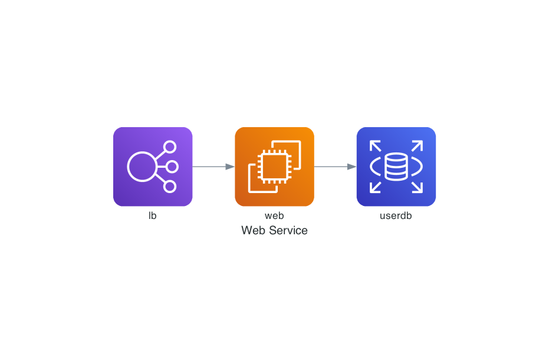

# Diagrams - Diagram as Code

> Diagrams lets you draw the cloud system architecture in Python code.

- 平常用比較兇的文字繪圖工具主要是 mermaid (流程圖) 或 PlantUML (Sequence Diagram)
- 若是手畫的架構圖，比較常用 draw.io，雖然偶爾會有同仁用 Excalidraw (手繪風)，但我個人還是比較喜歡可以做純文字版本控制。
- 第一次聽到 `Diagrams` 是有同仁用來畫 AWS 架構圖。最近有一些需求要畫複雜的網路連線架構（比較接近 Deployment Model），所以就來試試看用 Python 話架構圖吧！

## 2024-06-21

- 2024-06-21 10:39:19
- 環境建立：
```bash
$ brew install graphviz ## Diagrams 相依 graphviz，所以要先裝 graphviz。
$ pip3 install diagrams
```

- Graphviz 相依的 Homebrew 套件還挺多的。Linux 上相依套件更多。
- 看樣子還是 mermaid 比較輕量 (JavaScript)。
- PlantUML 是一個 JAR 檔，至少相依 JRE。（當然 PlantUML 也可以直接用官方的 Server，如果要繪製的圖不是太複雜的話。）

```bash
cloudshell:~$ debtree graphviz
Reading package lists... Done
Building dependency tree... Done
Reading state information... Done
digraph "graphviz" {
        rankdir=LR;
        node [shape=box];
        "graphviz" -> "libann0" [color=blue];
        "libann0" -> "libgcc-s1" [color=blue,label="(>= 3.0)"];
        "libgcc-s1" -> "gcc-12-base" [color=blue,label="(= 12.3.0-1ubuntu1~22.04)"];
        "graphviz" -> "libcdt5" [color=blue];
        "graphviz" -> "libcgraph6" [color=blue];
        "libcgraph6" -> "libcdt5" [color=blue];
        "graphviz" -> "libexpat1" [color=blue,label="(>= 2.0.1)"];
        "graphviz" -> "libgcc-s1" [color=blue,label="(>= 3.3.1)"];
        "graphviz" -> "libgd3" [color=blue,label="(>= 2.1.0~alpha~)"];
        "libgd3" -> "libfontconfig1" [color=blue,label="(>= 2.12.6)"];
        "libgd3" -> "libfreetype6" [color=blue,label="(>= 2.2.1)"];
        "libfreetype6" -> "libbrotli1" [color=blue,label="(>= 0.6.0)"];
        "libfreetype6" -> "libpng16-16" [color=blue,label="(>= 1.6.2-1)"];
        "libgd3" -> "libjpeg8" [color=blue,label="(>= 8c)"];
        "libjpeg8" -> "libjpeg-turbo8" [color=blue,label="(>= 1.1.90+svn722-1ubuntu6)"];
        "libgd3" -> "libpng16-16" [color=blue,label="(>= 1.6.2-1)"];
        "libgd3" -> "libtiff5" [color=blue,label="(>= 4.0.3)"];
        "libtiff5" -> "libdeflate0" [color=blue,label="(>= 1.0)"];
        "libtiff5" -> "libjbig0" [color=blue,label="(>= 2.0)"];
        "libtiff5" -> "libjpeg8" [color=blue,label="(>= 8c)"];
        "libtiff5" -> "liblzma5" [color=blue,label="(>= 5.1.1alpha+20120614)"];
        "libtiff5" -> "libwebp7" [color=blue];
        "libtiff5" -> "libzstd1" [color=blue,label="(>= 1.4.0)"];
        "libgd3" -> "libwebp7" [color=blue];
        "libgd3" -> "libxpm4" [color=blue];
        "graphviz" -> "libglib2.0-0" [color=blue,label="(>= 2.16.0)"];
        "graphviz" -> "libgts-0.7-5" [color=blue,label="(>= 0.7.6)"];
        "libgts-0.7-5" -> "libglib2.0-0" [color=blue,label="(>= 2.16.0)"];
        "libgts-0.7-5" -> "libgts-bin";
        "libgts-bin" -> "libglib2.0-0" [color=blue,label="(>= 2.16.0)"];
        "libgts-bin" -> "libgts-0.7-5" [color=blue,label="(= 0.7.6+darcs121130-5)"];
        "graphviz" -> "libgvc6" [color=blue,label="(>= 2.42.1)"];
        "libgvc6" -> "libcairo2" [color=blue,label="(>= 1.15.8)"];
        "libcairo2" -> "libfontconfig1" [color=blue,label="(>= 2.12.6)"];
        "libcairo2" -> "libfreetype6" [color=blue,label="(>= 2.9.1)"];
        "libcairo2" -> "libpixman-1-0" [color=blue,label="(>= 0.30.0)"];
        "libcairo2" -> "libpng16-16" [color=blue,label="(>= 1.6.2-1)"];
        "libcairo2" -> "libxcb-render0" [color=blue];
        "libxcb-render0" -> "libxcb1" [color=blue,label="(>= 1.8)"];
        "libxcb1" -> "libxau6" [color=blue,label="(>= 1:1.0.9)"];
        "libxcb1" -> "libxdmcp6" [color=blue];
        "libxdmcp6" -> "libbsd0" [color=blue,label="(>= 0.2.0)"];
        "libbsd0" -> "libmd0" [color=blue,label="(>= 1.0.3-2)"];
        "libcairo2" -> "libxcb-shm0" [color=blue];
        "libxcb-shm0" -> "libxcb1" [color=blue,label="(>= 1.12)"];
        "libcairo2" -> "libxcb1" [color=blue,label="(>= 1.6)"];
        "libcairo2" -> "libxext6" [color=blue];
        "libcairo2" -> "libxrender1" [color=blue];
        "libgvc6" -> "libcdt5" [color=blue];
        "libgvc6" -> "libcgraph6" [color=blue];
        "libgvc6" -> "libexpat1" [color=blue,label="(>= 2.0.1)"];
        "libgvc6" -> "libgcc-s1" [color=blue,label="(>= 3.3.1)"];
        "libgvc6" -> "libgd3" [color=blue,label="(>= 2.1.0~alpha~)"];
        "libgvc6" -> "libglib2.0-0" [color=blue,label="(>= 2.16.0)"];
        "libgvc6" -> "libgts-0.7-5" [color=blue,label="(>= 0.7.6)"];
        "libgvc6" -> "libltdl7" [color=blue,label="(>= 2.4.6)"];
        "libgvc6" -> "libpango-1.0-0" [color=blue,label="(>= 1.22.0)"];
        "libpango-1.0-0" -> "fontconfig" [color=blue,label="(>= 2.13.0)"];
        "libpango-1.0-0" -> "libfribidi0" [color=blue,label="(>= 1.0.6)"];
        "libpango-1.0-0" -> "libglib2.0-0" [color=blue,label="(>= 2.67.3)"];
        "libpango-1.0-0" -> "libharfbuzz0b" [color=blue,label="(>= 2.6.0)"];
        "libharfbuzz0b" -> "libfreetype6" [color=blue,label="(>= 2.9.1)"];
        "libharfbuzz0b" -> "libglib2.0-0" [color=blue,label="(>= 2.31.8)"];
        "libharfbuzz0b" -> "libgraphite2-3" [color=blue,label="(>= 1.2.2)"];
        "libharfbuzz0b" -> "libharfbuzz0" [color=red];
        "libharfbuzz0b" -> "libharfbuzz0a" [color=red];
        "libpango-1.0-0" -> "libthai0" [color=blue,label="(>= 0.1.25)"];
        "libthai0" -> "libthai-data" [color=blue,label="(>= 0.1.10)"];
        "libthai0" -> "libdatrie1" [color=blue,label="(>= 0.2.0)"];
        "libgvc6" -> "libpangocairo-1.0-0" [color=blue,label="(>= 1.14.0)"];
        "libpangocairo-1.0-0" -> "libcairo2" [color=blue,label="(>= 1.12.10)"];
        "libpangocairo-1.0-0" -> "libfontconfig1" [color=blue,label="(>= 2.13.0)"];
        "libpangocairo-1.0-0" -> "libglib2.0-0" [color=blue,label="(>= 2.62.0)"];
        "libpangocairo-1.0-0" -> "libharfbuzz0b" [color=blue,label="(>= 2.6.0)"];
        "libpangocairo-1.0-0" -> "libpango-1.0-0" [color=blue,label="(= 1.50.6+ds-2ubuntu1)"];
        "libpangocairo-1.0-0" -> "libpangoft2-1.0-0" [color=blue,label="(= 1.50.6+ds-2ubuntu1)"];
        "libpangoft2-1.0-0" -> "libfontconfig1" [color=blue,label="(>= 2.13.0)"];
        "libpangoft2-1.0-0" -> "libfreetype6" [color=blue,label="(>= 2.2.1)"];
        "libpangoft2-1.0-0" -> "libglib2.0-0" [color=blue,label="(>= 2.67.3)"];
        "libpangoft2-1.0-0" -> "libharfbuzz0b" [color=blue,label="(>= 2.6.0)"];
        "libpangoft2-1.0-0" -> "libpango-1.0-0" [color=blue,label="(= 1.50.6+ds-2ubuntu1)"];
        "libgvc6" -> "libpangoft2-1.0-0" [color=blue,label="(>= 1.14.0)"];
        "libgvc6" -> "libpathplan4" [color=blue];
        "libgvc6" -> "libwebp7" [color=blue];
        "graphviz" -> "libgvpr2" [color=blue];
        "libgvpr2" -> "libcdt5" [color=blue];
        "libgvpr2" -> "libcgraph6" [color=blue];
        "graphviz" -> "liblab-gamut1" [color=blue];
        "graphviz" -> "libxaw7" [color=blue];
        "libxaw7" -> "libxext6" [color=blue];
        "libxaw7" -> "libxmu6" [color=blue,label="(>= 2:1.1.3)"];
        "libxmu6" -> "libxext6" [color=blue];
        "libxmu6" -> "libxt6" [color=blue];
        "libxt6" -> "libice6" [color=blue,label="(>= 1:1.0.0)"];
        "libice6" -> "libbsd0" [color=blue,label="(>= 0.2.0)"];
        "libice6" -> "x11-common" [color=blue];
        "libxt6" -> "libsm6" [color=blue];
        "libsm6" -> "libice6" [color=blue,label="(>= 1:1.0.0)"];
        "libsm6" -> "libuuid1" [color=blue,label="(>= 2.16)"];
        "libuuid1" -> "uuid-runtime";
        "uuid-runtime" -> "libuuid1" [color=purple,style=bold];
        "uuid-runtime" -> "init-system-helpers" [color=purple,style=bold,label="(>= 1.54~)"];
        "init-system-helpers" -> "perl-base" [color=blue,label="(>= 5.20.1-3)"];
        "perl-base" -> "libcrypt1" [color=purple,style=bold,label="(>= 1:4.1.0)"];
        "perl-base" -> "dpkg" [color=purple,style=bold,label="(>= 1.17.17)"];
        "uuid-runtime" -> "adduser" [color=blue];
        "adduser" -> "passwd" [color=blue];
        "adduser" -> "alt1":"debconf" [color=blue,label="(>= 0.5)"];
        "alt1":"debconf-2.0" -> virt1 [dir=back,arrowtail=inv,color=green];
        "uuid-runtime" -> "libsmartcols1" [color=blue,label="(>= 2.27~rc1)"];
        "uuid-runtime" -> "libsystemd0" [color=blue];
        "libsystemd0" -> "libcap2" [color=purple,style=bold,label="(>= 1:2.24-9~)"];
        "libsystemd0" -> "libgcrypt20" [color=purple,style=bold,label="(>= 1.9.0)"];
        "libgcrypt20" -> "libgpg-error0" [color=blue,label="(>= 1.27)"];
        "libgpg-error0" -> "libgpg-error-l10n";
        "libsystemd0" -> "liblz4-1" [color=purple,style=bold,label="(>= 0.0~r122)"];
        "libsystemd0" -> "liblzma5" [color=purple,style=bold,label="(>= 5.1.1alpha+20120614)"];
        "libsystemd0" -> "libzstd1" [color=purple,style=bold,label="(>= 1.4.0)"];
        "uuid-runtime" -> "libuuid1" [color=blue,label="(>= 2.31.1)"];
        "libxaw7" -> "libxpm4" [color=blue];
        "libxaw7" -> "libxt6" [color=blue];
        "graphviz" -> "libxmu6" [color=blue];
        "graphviz" -> "libxt6" [color=blue];
        "graphviz" -> "fonts-liberation";
        "graphviz" [style="setlinewidth(2)"]
        "libharfbuzz0" [style=filled,fillcolor=oldlace];
        "libharfbuzz0a" [style=filled,fillcolor=oldlace];
        alt1 [
                shape = "record"
                label = "<debconf> \{debconf\} | <debconf-2.0> debconf-2.0"
        ]
        virt1 [
                shape = "record"
                style = "rounded"
                label = "<debconf> [debconf] | <cdebconf> \{cdebconf\}"
        ]
        "dpkg" [shape=diamond];
        "fontconfig" [shape=diamond];
        "libfontconfig1" [shape=diamond];
        "libglib2.0-0" [shape=diamond];
        "passwd" [shape=diamond];
        "x11-common" [shape=diamond];
}
I: The following dependencies have been excluded from the graph (skipped):
I: libc6 libstdc++6 libx11-6 zlib1g
// Excluded dependencies:
// libc6 libstdc++6 libx11-6 zlib1g
// total size of all shown packages: 37260288
// download size of all shown packages: 12676900
```

- 實驗一：
```bash
jazzwang:~/git/snippet/python/diagrams$ cat >> quick-start.py << EOF
from diagrams import Diagram
from diagrams.aws.compute import EC2
from diagrams.aws.database import RDS
from diagrams.aws.network import ELB

with Diagram("Web Service", show=False):
    ELB("lb") >> EC2("web") >> RDS("userdb")
EOF
jazzwang:~/git/snippet/python/diagrams$ python3 quick-start.py
```
- 結果：


- 2024-06-21 11:47:25
- Graphviz 相依性太多，把實驗移到 Google Cloud Shell 做。