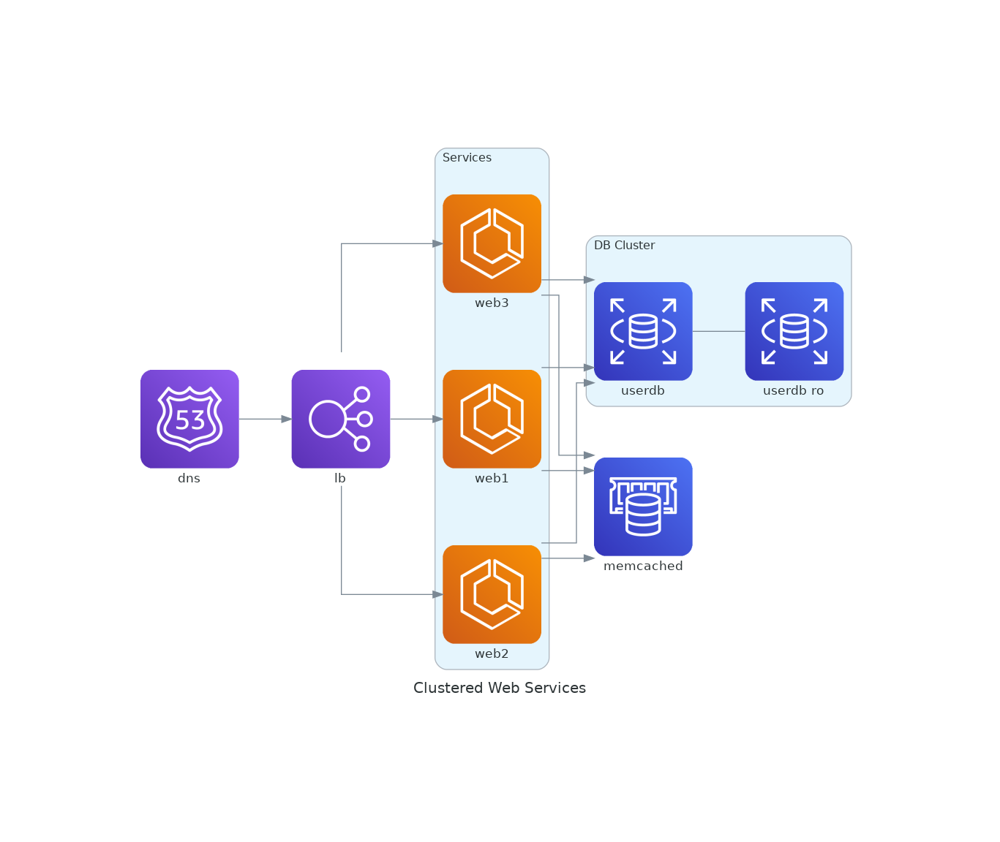
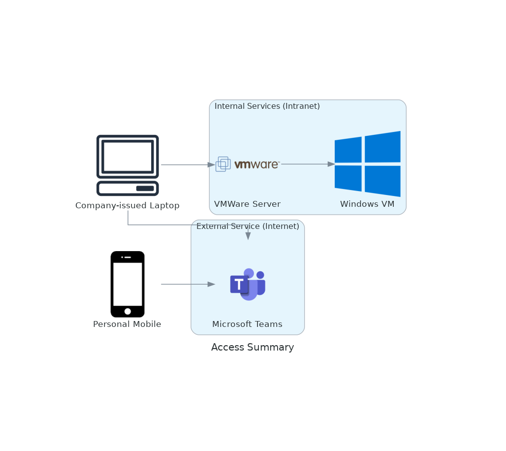

# Diagrams - Diagram as Code

[TOC]

> .
> Diagrams lets you draw the cloud system architecture in Python code.
> .

- 平常用比較兇的文字繪圖工具主要是 [mermaid](https://mermaid.js.org/) (流程圖) 或 [PlantUML](https://plantuml.com/) (Sequence Diagram)
- 若是手畫的架構圖，比較常用 draw.io，雖然偶爾會有同仁用 [Excalidraw](https://excalidraw.com/) (手繪風)，但我個人還是比較喜歡可以做純文字版本控制。
- 第一次聽到 `Diagrams` 是有同仁用來畫 AWS 架構圖。最近有一些需求要畫複雜的網路連線架構（比較接近 Deployment Model），所以就來試試看用 Python 話架構圖吧！

## 2024-06-21

- 2024-06-21 10:39:19
- 環境建立：
```bash
$ brew install graphviz ## Diagrams 相依 graphviz，所以要先裝 graphviz。
$ pip3 install diagrams
```

- Graphviz 相依的 Homebrew 套件還挺多的。Linux 上相依套件更多。
- 看樣子還是 mermaid 比較輕量 (JavaScript)。
- PlantUML 是一個 JAR 檔，至少相依 JRE。
> 當然 PlantUML 也可以直接用官方的 Server，如果要繪製的圖不是太複雜的話。

### 實驗一：

```bash
jazzwang:~/git/snippet/python/diagrams$ cat >> quick-start.py << EOF
from diagrams import Diagram
from diagrams.aws.compute import EC2
from diagrams.aws.database import RDS
from diagrams.aws.network import ELB

with Diagram("Web Service", show=False):
    ELB("lb") >> EC2("web") >> RDS("userdb")
EOF
jazzwang:~/git/snippet/python/diagrams$ python3 quick-start.py
```
- 結果：


- 2024-06-21 11:47:25
- Graphviz 相依性太多，把實驗移到 Google Cloud Shell 做。

### 實驗二：

```
bash
$ cat >> clustered-web-services.py << EOF
from diagrams import Cluster, Diagram
from diagrams.aws.compute import ECS
from diagrams.aws.database import ElastiCache, RDS
from diagrams.aws.network import ELB
from diagrams.aws.network import Route53

with Diagram("Clustered Web Services", show=False):
    dns = Route53("dns")
    lb = ELB("lb")

    with Cluster("Services"):
        svc_group = [ECS("web1"),
                     ECS("web2"),
                     ECS("web3")]

    with Cluster("DB Cluster"):
        db_primary = RDS("userdb")
        db_primary - [RDS("userdb ro")]

    memcached = ElastiCache("memcached")

    dns >> lb >> svc_group
    svc_group >> db_primary
    svc_group >> memcached
EOF
$ python3 clustered-web-services.py
```
- 結果


### 實驗三：
- 預計用到
  - https://diagrams.mingrammer.com/docs/nodes/onprem
    - diagrams.onprem.client.Client - 筆電
  - https://diagrams.mingrammer.com/docs/nodes/generic
    - diagrams.generic.device.Mobile - 手機
    - diagrams.generic.os.Windows - Windows 作業系統
    - diagrams.generic.virtualization.Vmware - VMWare
  - 參考 https://diagrams.mingrammer.com/docs/nodes/saas
    - diagrams.saas.chat.Teams - Microsoft Teams
- 實作：[lab1.py](lab1.py)
```python
from diagrams import Cluster, Diagram
from diagrams.onprem.client import Client ## 筆電
from diagrams.generic.device import Mobile ## 手機
from diagrams.generic.os import Windows ## Windows 作業系統
from diagrams.generic.virtualization import Vmware ## VMWare
from diagrams.saas.chat import Teams ## Microsoft Teams

with Diagram("Access Summary", show=False):
    laptop = Client("Company-issued Laptop")
    mobile = Mobile("Personal Mobile")

    with Cluster("Internal Services (Intranet)"):
      vdi = Vmware("VMWare Server")
      vm = Windows("Windows VM")

    with Cluster("External Service (Internet)"):
      teams = Teams("Microsoft Teams")

    laptop >> vdi >> vm
    laptop >> teams
    mobile >> teams
```
- 結果:
