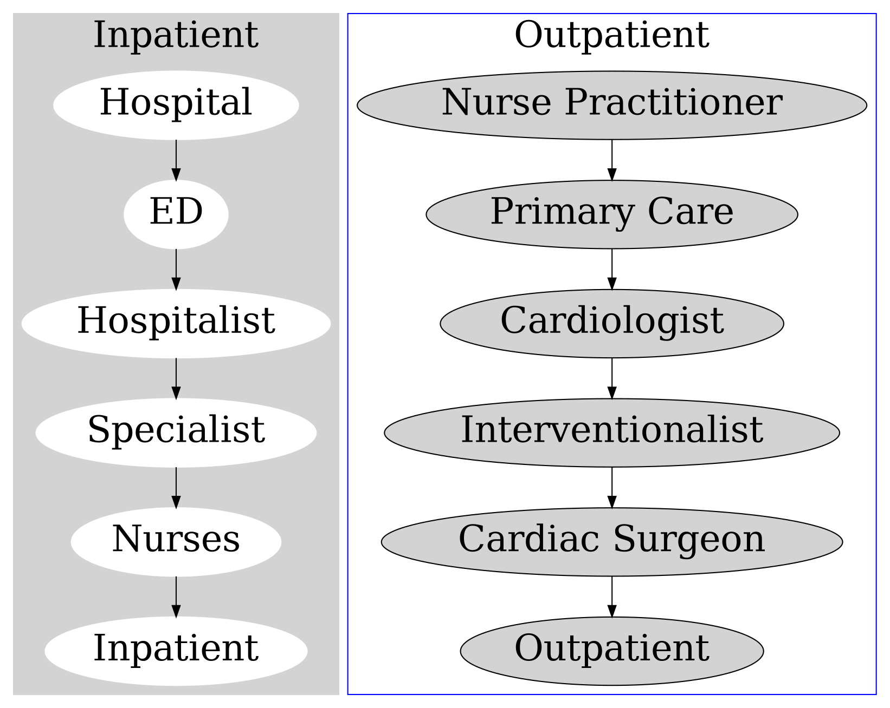

---
presentation:
    theme: night.css
    width: 1920
    height: 1080
    slideNumber: true
    hideAddressBar: true
    history: true
---

<!-- slide -->

## Virtical Integration   in Healthcare

By [Jazz Yao-Tsung Wang](https://slideshare.net/jazzwang)
2019-09-02

<!-- slide -->

### My first impression ...

* Reviewing my idea for DevCon 2018 after I joined for 6 months ...

Vertival Integration of **Data Pipeline**
from **Provider** to **Payer** for providing **Value** to **Consumer**

DevCon 2018 Ideation by Jazz Yao-Tsung Wang @ 2018-07-14 

<!-- slide -->

* **Business Model**: B-to-B-to-C ( CHC - Payer - Patient )
* **Deliverable**: Web Services for each Payer that help Patient to identify their best package for each payer.
* **Value proposition for Payer**: Customer Relationship Management (inspired by Telecom fare diagnosis service in Taiwan).

<!-- slide -->

#### Vertical Integration in "Change Healthcare"?

https://www.google.com/search?q="vertical%20integration"+site%3Achangehealthcare.com

<!-- slide -->

#### But ...

Learned from the perspective of Cardiologist

<iframe width="560" height="315" src="https://www.youtube.com/embed/S40xaVjmetM" frameborder="0" allow="accelerometer; autoplay; encrypted-media; gyroscope; picture-in-picture" allowfullscreen></iframe>

<blockquote>
A presentation from the 2015 The New Orleans Conference  covering the topic of integration in healthcare  and how it affects those in the cardiac surgery specialty.
</blockquote>

<i>-- Source: "Vertical vs Horizontal Integration in Cardiac Surgery", Arie Blitz, MD, 2015</i>
https://www.youtube.com/watch?v=S40xaVjmetM

<!-- slide -->

# Definitions

<!-- slide -->

### What is 'Horizontal integration'?

<iframe width='80%' src='https://en.wikipedia.org/wiki/Horizontal_integration' height="600"></iframe>

https://en.wikipedia.org/wiki/Horizontal_integration

<!-- slide -->

#### Horizontal integration

* Increase production of goods or services **at the same part of the supply chain** via:
  * internal expansion
  * acquisition 
  * merger

@import "https://upload.wikimedia.org/wikipedia/commons/f/fc/Integration_in_English.svg"

<!-- slide -->

### What is 'Vertical Integration'?

##### https://en.wikipedia.org/wiki/Vertical_integration

<iframe width='80%' src='https://en.wikipedia.org/wiki/Vertical_integration' height="600"></iframe>

<!-- slide -->

### Vertical Integration

* Bring large portions of the supply chain not only **<u>under a common ownership</u>**, 
but also **<u>into one corporation</u>**
* Three types of Vertical Integration: (A) **backwards** (upstream), (B) **forwards** (downstream), 
(C) **balanced** (both upstream and downstream)

@import "https://upload.wikimedia.org/wikipedia/commons/f/fc/Integration_in_English.svg"

<!-- slide -->

## Goal of Vertical Integration in Healthcare:
### Create superior Value in the healthcare marketplace
#### - improving patient care quality
#### - bending the cost curve

* Remember the definition of `Healthcare Value` in "Value-based Healthcare" sharing?

$$
\text{Healthcare Value}\text{ } = \text{ } {\text{Quality of Care} \over \text{Cost of Care}}
$$

<!-- slide -->

### Vertical Integration in Healthcare Provider

* Emergency department (ED)
<i>-- Source: "Vertical vs Horizontal Integration in Cardiac Surgery", Arie Blitz, MD, 2015</i>
https://www.youtube.com/watch?v=S40xaVjmetM

<!-- slide -->

### Vertical Integration: 80’s Fad or Health Care’s Future?
July 1, **1997**

@import "https://i.imgur.com/cwYsuBk.png" {width=45%}

https://www.strategy-business.com/article/18205?gko=a00f6

<!-- slide -->

### Cases for Vertical Integration between Payors and Providers

* owning physicians gives a health plan greater influence over practice patterns and **reduces the use of medical resources**

* owning hospitals allows an insurer to **control medical facility capacity** and generate **lower unit costs**

* combining insurance, physician and hospital components under one entity yields **reductions in administrative costs**

<i>-- Source: "Vertical Integration: 80’s Fad or Health Care’s Future?", 1997-07-01</i>
https://www.strategy-business.com/article/18205?gko=a00f6

<!-- slide -->

### Vertical Integration throughtout 1980's ...

* **Kaiser** expand its owned hospitals and contracted exclusively with the **Permanente Group**

* **Aetna** built staff model clinics across the country

* **CIGNA** also built staff model clinics and acquired the **Lovelace integrated health system**

* **FHP** owned health plans, physician clinics and hospitals

* **Prudential** invested in the "group model" [H.M.O.](https://en.wikipedia.org/wiki/Health_maintenance_organization) and owned/managed clinic assets

* **Humana** owned health plans and hospitals

* **Henry Ford Hospital System**, **Sentara** and **Geisinger** started up their own [H.M.O.](https://en.wikipedia.org/wiki/Health_maintenance_organization)'s

<i>-- Source: "Vertical Integration: 80’s Fad or Health Care’s Future?", 1997-07-01</i>
https://www.strategy-business.com/article/18205?gko=a00f6

<!-- slide -->

### Horizontal Consolidation in 1990's

* **Kaiser** is **renting hospital capacity** rather than owning it, and has started to **contract with non-Permanente physicians** to supplement its core networks.

* **Aetna** sold its physician practice management company to **MedPartners**.

* **CIGNA** divested its southern California clinics to **MedPartners**.

* **FHP** sold its hospitals and created a separate subsidiary for its group practice, ostensibly as a first step toward spinning it off.

<i>-- Source: "Vertical Integration: 80’s Fad or Health Care’s Future?", 1997-07-01</i>
https://www.strategy-business.com/article/18205?gko=a00f6

<!-- slide -->

### Why refocus on vertical intergration again?

## Affordable Care Act (ACA)
### March 23, **2010**

https://en.wikipedia.org/wiki/Patient_Protection_and_Affordable_Care_Act

<!-- slide -->

### ACA encourages integration

<table>
<tr>
<td>
<ul>
  <li>Payment Reform
  <ul>
    <li>Pay-for-performance (P4P)
    <li>Bundled payments
    <li>Episodes of Care
    <li>Coverage of uninsured
  </ul>
  <li>Health Care Delivery
  <ul>
    <li>Medical Homes being formed
    <li>Accountable Care Organizations (ACOs)
    <li>Reengineering of care
  </ul>
</ul>
</td>
<td>

</td>
</table>

<i>-- Source: "Vertical vs Horizontal Integration in Cardiac Surgery", Arie Blitz, MD, 2015</i>
https://www.youtube.com/watch?v=S40xaVjmetM

<!-- slide -->

### The Way Forward for Integrated Care
#### 31 March, **2014**

##### https://ldi.upenn.edu/way-forward-integrated-care

<!-- slide -->

### Hospital-Physician Integration

<blockquote>
The percentage of physicians employed by hospitals has increased  from 11% in 2000 to nearly 15% in 2008.
</blockquote>

<blockquote>
It has led to financial losses approaching $200,000 per year per physician, double the losses incurred   during the early period of integration in the 1990s.
</blockquote>

<i>-- "The Way Forward for Integrated Care", 2014-03-31</i>
https://ldi.upenn.edu/way-forward-integrated-care

<!-- slide -->

### "Virtual Integration" ?

<blockquote>
There is also a movement towards "virtual integration" which allows a physician to remain independent but exploit some of the advantages of group practice, including centralized administration, risk spreading, and leverage with health plans. 
</blockquote>

<i>-- "The Way Forward for Integrated Care", 2014-03-31</i>
https://ldi.upenn.edu/way-forward-integrated-care

<!-- slide -->
### Vertical Integration in Healthcare Provider (PROs & CONs)

<i>-- Source: "Vertical vs Horizontal Integration in Cardiac Surgery", Arie Blitz, MD, 2015</i>
https://www.youtube.com/watch?v=S40xaVjmetM

<!-- slide -->
### Horizontal Integration in Healthcare Provider (PROs & CONs)

<i>-- Source: "Vertical vs Horizontal Integration in Cardiac Surgery", Arie Blitz, MD, 2015</i>
https://www.youtube.com/watch?v=S40xaVjmetM

<!-- slide -->
### Economic Barriers to Integration

* Fee-for-service (FFS)
<i>-- Source: "Vertical vs Horizontal Integration in Cardiac Surgery", Arie Blitz, MD, 2015</i>
https://www.youtube.com/watch?v=S40xaVjmetM

<!-- slide -->

### Vertical Integration in Healthcare  Doesn’t Boost Care Quality
#### February 14, 2019

@import "https://i.imgur.com/aK9hmUb.png" {width=30%}

<blockquote>
A new study from Rice University’s Baker Institute for Public Policy shows vertical integration in healthcare has little to no impact on care quality.
</blockquote>

<i>-- Source: "Vertical Integration in Healthcare Doesn’t Boost Care Quality", 2019-02-14</i>
https://revcycleintelligence.com/news/vertical-integration-in-healthcare-doesnt-boost-care-quality

<!-- slide -->

## How about the role of 
# "Platform"
## in Vertical Integration?

<!-- slide -->

# Discussion
## The position of Change Healthcare in Vert?

<!-- slide -->

### Let's take a look Roles  in Digital Marketing (AdTech)

@import "https://image.slidesharecdn.com/2017-11-12datapipelinematters-171112161249/95/data-pipeline-matters-16-638.jpg" {width=70%}

<!-- slide -->

### Revisit the position of Change Healthcare

<table style="border: 0.5pt solid black; text-align: center; vertical-align:middle;">
<tr>
<td style="border: 0.5pt solid black; text-align: center; vertical-align:middle;" bgcolor="#D9EAD3">
Digital Marketing (AdTech)
</td>
<td style="border: 0.5pt solid black; text-align: center; vertical-align:middle;" bgcolor="#FFFFFF">
⟷</td>
<td style="border: 0.5pt solid black; text-align: center; vertical-align:middle;" bgcolor="#FCE5CD">
Healthcare IT
</td>
</tr>
<tr>
<td style="border: 0.5pt solid black; text-align: center; vertical-align:middle;" bgcolor="#D9EAD3">
Audience: website visitor</td>
<td style="border: 0.5pt solid black; text-align: center; vertical-align:middle;" bgcolor="#FFFFFF">
⟷</td>
<td style="border: 0.5pt solid black; text-align: center; vertical-align:middle;" bgcolor="#FCE5CD">
Patient</td>
</tr>
<tr>
<td style="border: 0.5pt solid black; text-align: center; vertical-align:middle;" bgcolor="#D9EAD3">
Demand side</td>
<td style="border: 0.5pt solid black; text-align: center; vertical-align:middle;" bgcolor="#FFFFFF">
⟷</td>
<td style="border: 0.5pt solid black; text-align: center; vertical-align:middle;" bgcolor="#FCE5CD">
<b>Payer</b>: Insurer</td>
</tr>
<tr>
<td style="border: 0.5pt solid black; text-align: center; vertical-align:middle;" bgcolor="#D9EAD3">
Advertising Network (Platform)</td>
<td style="border: 0.5pt solid black; text-align: center; vertical-align:middle;" bgcolor="#FFFFFF">
⟷</td>
<td style="border: 0.5pt solid black; text-align: center; vertical-align:middle;" bgcolor="#FCE5CD">
<b>Financial Data</b>: Cleaning House <b>Clinic Data</b>: CommonWell</td>
</tr>
<tr>
<td style="border: 0.5pt solid black; text-align: center; vertical-align:middle;" bgcolor="#D9EAD3">
Supply side: Publisher (Website)</td>
<td style="border: 0.5pt solid black; text-align: center; vertical-align:middle;" bgcolor="#FFFFFF">
⟷</td>
<td style="border: 0.5pt solid black; text-align: center; vertical-align:middle;" bgcolor="#FCE5CD">
<b>Provider</b>: Hospital, Clinic, Dental, Lab</td>
</tr>

<!-- slide -->

# Q & A