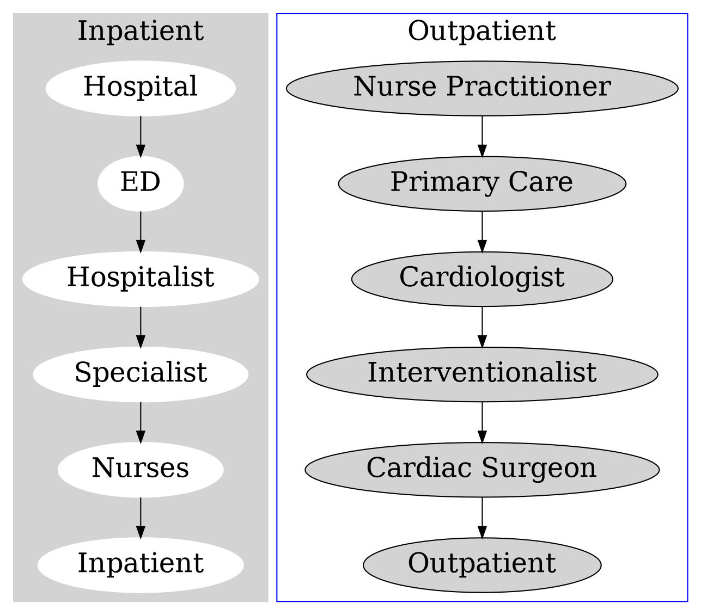

---
presentation:
    theme: night.css
    width: 1920
    height: 1080
    slideNumber: true
    hideAddressBar: true
    history: true
---

<!-- slide -->

# Virtical Integration   in Healthcare

By [Jazz Yao-Tsung Wang](https://slideshare.net/jazzwang)
2019-09-02

<!-- slide -->

### My first impression ...

* Reviewing my idea for DevCon 2018 after I joined for 6 months ...

Vertival Integration of **Data Pipeline**
from **Provider** to **Payer** for providing **Value** to **Consumer**

DevCon 2018 Ideation by Jazz Yao-Tsung Wang @ 2018-07-14 

<!-- slide -->

* **Business Model**: B-to-B-to-C ( CHC - Payer - Patient )
* **Deliverable**: Web Services for each Payer that help Patient to identify their best package for each payer.
* **Value proposition for Payer**: Customer Relationship Management   (inspired by Telecom fare diagnosis service in Taiwan).

<!-- slide -->

#### Vertical Integration in "Change Healthcare"?

@import "https://i.imgur.com/TxL8jIq.png" {width=40%}

<i><small>-- Source: https://www.google.com/search?q="vertical%20integration"+site%3Achangehealthcare.com</small></i>

<!-- slide -->

#### But ...

Learned from the perspective of Cardiologist

<iframe width="560" height="315" src="https://www.youtube.com/embed/S40xaVjmetM" frameborder="0" allow="accelerometer; autoplay; encrypted-media; gyroscope; picture-in-picture" allowfullscreen></iframe>

<blockquote>
A presentation from the 2015 The New Orleans Conference  covering the topic of integration in healthcare  and how it affects those in the cardiac surgery specialty.
</blockquote>

<i><small>-- Source: "Vertical vs Horizontal Integration in Cardiac Surgery", Arie Blitz, MD, 2015
https://www.youtube.com/watch?v=S40xaVjmetM</small></i>

<!-- slide -->

# Definitions

<!-- slide -->

### What is "Horizontal integration"?

<iframe width="80%" src="https://en.wikipedia.org/wiki/Horizontal_integration" height="600"></iframe>

<i><small>-- Source: https://en.wikipedia.org/wiki/Horizontal_integration</small></i>

<!-- slide -->

#### Horizontal integration

* Increase production of goods or services **at the same part of the supply chain** via:
  * internal expansion
  * acquisition 
  * merger

@import "https://upload.wikimedia.org/wikipedia/commons/f/fc/Integration_in_English.svg" {width=40%}

<!-- slide -->

### What is "Vertical Integration"?

<iframe width="80%" src="https://en.wikipedia.org/wiki/Vertical_integration" height="600"></iframe>

<i><small>-- Source: https://en.wikipedia.org/wiki/Vertical_integration</small></i>

<!-- slide -->

### Vertical Integration

* Bring large portions of the supply chain not only **under a common ownership**, 
but also **into one corporation**
* Three types of Vertical Integration: (A) **backwards** (upstream), (B) **forwards** (downstream), 
(C) **balanced** (both upstream and downstream)

@import "https://upload.wikimedia.org/wikipedia/commons/f/fc/Integration_in_English.svg" {width=40%}

<!-- slide -->

## Goal of Vertical Integration in Healthcare

### Create superior Value in the healthcare marketplace
#### - improving patient care quality
#### - bending the cost curve

$$
\Huge
\text{Healthcare Value}\text{ } \uparrow \text{ } = \text{ } {\text{Quality of Care}\text{ }\uparrow \over \text{Cost of Care}\text{ }\downarrow}
$$

<i><small>Remember the definition of Healthcare Value in "Value-based Healthcare" sharing?</small></i>

<!-- slide -->

### Vertical Integration in Healthcare Provider

* Emergency department (ED)
<i><small>
-- Source: "Vertical vs Horizontal Integration in Cardiac Surgery", Arie Blitz, MD, 2015
https://www.youtube.com/watch?v=S40xaVjmetM</small></i>

<!-- slide -->

### Vertical Integration: 80’s Fad or Health Care’s Future?
July 1, **1997**

@import "https://i.imgur.com/cwYsuBk.png" {width=40%}

<i><small>-- Source: "Vertical Integration: 80’s Fad or Health Care’s Future?", 1997-07-01
https://www.strategy-business.com/article/18205?gko=a00f6</small></i>

<!-- slide -->

### Cases for Vertical Integration between Payors and Providers

* owning physicians gives a health plan greater influence over practice patterns and   **reduces the use of medical resources**

* owning hospitals allows an insurer to **control medical facility capacity** and generate   **lower unit costs**

* combining insurance, physician and hospital components under one entity yields   **reductions in administrative costs**

<i><small>-- Source: "Vertical Integration: 80’s Fad or Health Care’s Future?", 1997-07-01
https://www.strategy-business.com/article/18205?gko=a00f6</small></i>

<!-- slide -->

### Vertical Integration throughtout 1980's ...

* **Kaiser** expand its owned hospitals and contracted exclusively with the **Permanente Group**

* **Aetna** built staff model clinics across the country

* **CIGNA** also built staff model clinics and acquired the **Lovelace integrated health system**

* **FHP** owned health plans, physician clinics and hospitals

* **Prudential** invested in the "group model" [H.M.O.](https://en.wikipedia.org/wiki/Health_maintenance_organization) and owned/managed clinic assets

* **Humana** owned health plans and hospitals

* **Henry Ford Hospital System**, **Sentara** and **Geisinger** started up their own [H.M.O.](https://en.wikipedia.org/wiki/Health_maintenance_organization)'s

<i><small>-- Source: "Vertical Integration: 80’s Fad or Health Care’s Future?", 1997-07-01
https://www.strategy-business.com/article/18205?gko=a00f6</small></i>

<!-- slide -->

### Horizontal Consolidation in 1990's

* **Kaiser** is **renting hospital capacity** rather than owning it, and has started to **contract with non-Permanente physicians** to supplement its core networks.

* **Aetna** sold its physician practice management company to **MedPartners**.

* **CIGNA** divested its southern California clinics to **MedPartners**.

* **FHP** sold its hospitals and created a separate subsidiary for its group practice, ostensibly as a first step toward spinning it off.

<i><small>-- Source: "Vertical Integration: 80’s Fad or Health Care’s Future?", 1997-07-01
https://www.strategy-business.com/article/18205?gko=a00f6</small></i>

<!-- slide -->

### Why refocus on vertical intergration again?

## Affordable Care Act (ACA)
### March 23, **2010**

<i><small> -- Source: https://en.wikipedia.org/wiki/Patient_Protection_and_Affordable_Care_Act</small></i>

<!-- slide -->

### ACA encourages integration

<table>
<tr>
<td>
<ul>
  <li>Payment Reform
  <ul>
    <li>Pay-for-performance (P4P)
    <li>Bundled payments
    <li>Episodes of Care
    <li>Coverage of uninsured
  </ul>
  <li>Health Care Delivery
  <ul>
    <li>Medical Homes being formed
    <li>Accountable Care Organizations (ACOs)
    <li>Reengineering of care
  </ul>
</ul>
</td>
<td>

</td>
</table>

<i><small>-- Source: "Vertical vs Horizontal Integration in Cardiac Surgery", Arie Blitz, MD, 2015
https://www.youtube.com/watch?v=S40xaVjmetM</small></i>

<!-- slide -->

### The Way Forward for Integrated Care
#### 31 March, **2014**

<i><small>-- Source: "The Way Forward for Integrated Care", 2014-03-31
https://ldi.upenn.edu/way-forward-integrated-care</small></i>

<!-- slide -->

### Hospital-Physician Integration

<blockquote>
The percentage of physicians employed by hospitals has increased  from 11% in 2000 to nearly 15% in 2008.
</blockquote>

<blockquote>
It has led to financial losses approaching $200,000 per year per physician, double the losses incurred   during the early period of integration in the 1990s.
</blockquote>

<i><small>-- Source: "The Way Forward for Integrated Care", 2014-03-31
https://ldi.upenn.edu/way-forward-integrated-care</small></i>

<!-- slide -->

### Physician - Hospital - Health Plan Integration

<blockquote>
Another form of vertical integration is   between providers and health insurance plans. 
</blockquote>
<blockquote>
There are several well-known examples of these systems,  including Kaiser Health Plan and other major integrated systems  (e.g., Mayo Clinic, Cleveland Clinic). 
</blockquote>
<blockquote>
The success of these integrated systems can be attributed to a number of features, in particular a notably physician-driven system, unified clinical and administrative cultures, a long history with sufficient time to develop this culture, and strong economic interdependence among their three arms (the physicians, the hospital, and the health plan).
</blockquote>

<i><small>-- Source: "The Way Forward for Integrated Care", 2014-03-31
https://ldi.upenn.edu/way-forward-integrated-care</small></i>

<!-- slide -->

### "Virtual Integration" ?

<blockquote>
There is also a movement towards "virtual integration" which allows a physician to remain independent but exploit some of the advantages of group practice, including centralized administration, risk spreading, and leverage with health plans. 
</blockquote>

<i><small>-- Source: "The Way Forward for Integrated Care", 2014-03-31
https://ldi.upenn.edu/way-forward-integrated-care</small></i>

<!-- slide -->
### Vertical Integration in Healthcare Provider (PROs & CONs)

@import "https://i.imgur.com/45m9elj.jpg" {width=60%}

<i><small>-- Source: "Vertical vs Horizontal Integration in Cardiac Surgery", Arie Blitz, MD, 2015
https://www.youtube.com/watch?v=S40xaVjmetM</small></i>

<!-- slide -->
### Horizontal Integration in Healthcare Provider (PROs & CONs)

@import "https://i.imgur.com/642cV1y.jpg" {width=60%}

<i><small>-- Source: "Vertical vs Horizontal Integration in Cardiac Surgery", Arie Blitz, MD, 2015
https://www.youtube.com/watch?v=S40xaVjmetM</small></i>

<!-- slide -->
### Economic Barriers to Integration

@import "https://i.imgur.com/EEDlGiP.jpg" {width=60%}

<i><small>-- Source: "Vertical vs Horizontal Integration in Cardiac Surgery", Arie Blitz, MD, 2015
https://www.youtube.com/watch?v=S40xaVjmetM</small></i>

* Fee-for-service (FFS)

<!-- slide -->

### Vertical Integration in Healthcare  Doesn’t Boost Care Quality
#### February 14, 2019

@import "https://i.imgur.com/aK9hmUb.png" {width=30%}

<blockquote>
A new study from Rice University’s Baker Institute for Public Policy shows vertical integration in healthcare has little to no impact on care quality.
</blockquote>

<i><small>-- Source: "Vertical Integration in Healthcare Doesn’t Boost Care Quality", 2019-02-14
https://revcycleintelligence.com/news/vertical-integration-in-healthcare-doesnt-boost-care-quality</small></i>

<!-- slide -->

## How about the role of 
# "Platform"
## in Vertical Integration?

<!-- slide -->

# <u>Discussion</u>
## The position of   Change Healthcare  in Vertical Integration?

<!-- slide -->

### Let's take a look at  Roles in Digital Marketing (AdTech)

@import "https://image.slidesharecdn.com/2017-11-12datapipelinematters-171112161249/95/data-pipeline-matters-16-638.jpg" {width=40%}

<i><small>-- Source: "Data Pipeline Matters -- take tracking pixel as an example", Jazz Yao-Tsung Wang, 2018
https://www.slideshare.net/jazzwang/data-pipeline-matters</small></i>

<!-- slide -->

### Revisit the position of Change Healthcare

Mapping roles in "Healthcare IT" and "Digital Marketing (AdTech)" ...

<table style="border: 0.5pt solid black; text-align: center; vertical-align:middle;">
<tr>
<td style="border: 0.5pt solid black; text-align: center; vertical-align:middle;" bgcolor="#D9EAA3">
<b>Digital Marketing (AdTech)</b>
</td>
<td style="border: 0.5pt solid black; text-align: center; vertical-align:middle;" bgcolor="#FFFFFF">
⟷</td>
<td style="border: 0.5pt solid black; text-align: center; vertical-align:middle;" bgcolor="#FCE59D">
<b>Healthcare IT</b>
</td>
</tr><tr><td colspan="3"></td></tr><tr>
<td style="border: 0.5pt solid black; text-align: center; vertical-align:middle;" bgcolor="#D9EAD3">
<b>Audience</b>: Website Visitor</td>
<td style="border: 0.5pt solid black; text-align: center; vertical-align:middle;" bgcolor="#FFFFFF">
⟷</td>
<td style="border: 0.5pt solid black; text-align: center; vertical-align:middle;" bgcolor="#FCE5CD">
<b>Consumer</b>: Patient</td>
</tr>
</tr><tr><td colspan="3"></td></tr><tr>
<tr>
<td style="border: 0.5pt solid black; text-align: center; vertical-align:middle;" bgcolor="#D9EAD3">
<b>Demand</b> side: Budget Source</td>
<td style="border: 0.5pt solid black; text-align: center; vertical-align:middle;" bgcolor="#FFFFFF">
⟷</td>
<td style="border: 0.5pt solid black; text-align: center; vertical-align:middle;" bgcolor="#FCE5CD">
<b>Payer</b>: Insurer</td>
</tr>
</tr><tr><td colspan="3"></td></tr><tr>
<tr>
<td style="border: 0.5pt solid black; text-align: center; vertical-align:middle;" bgcolor="#D9EAD3">
<b>Platform</b>: Advertising Network</td>
<td style="border: 0.5pt solid black; text-align: center; vertical-align:middle;" bgcolor="#FFFFFF">
⟷</td>
<td style="border: 0.5pt solid black; text-align: center; vertical-align:middle;" bgcolor="#FCE5CD">
<b>Financial Data</b>: Cleaning House <b>Clinic Data</b>: CommonWell</td>
</tr>
</tr><tr><td colspan="3"></td></tr><tr>
<tr>
<td style="border: 0.5pt solid black; text-align: center; vertical-align:middle;" bgcolor="#D9EAD3">
<b>Supply</b> side: Publisher (Website)</td>
<td style="border: 0.5pt solid black; text-align: center; vertical-align:middle;" bgcolor="#FFFFFF">
⟷</td>
<td style="border: 0.5pt solid black; text-align: center; vertical-align:middle;" bgcolor="#FCE5CD">
<b>Provider</b>: Hospital, Clinic, Dental, Lab</td>
</tr>
</table>

Can we reproduce the Disruptive innovation in AdTech like **Facebook**?

<!-- slide -->

# Q & A

<blockquote>
Today's sharing is majorly talking about <h3>different types of "Supply Chain"</h3> in healthcare!!
</blockquote>