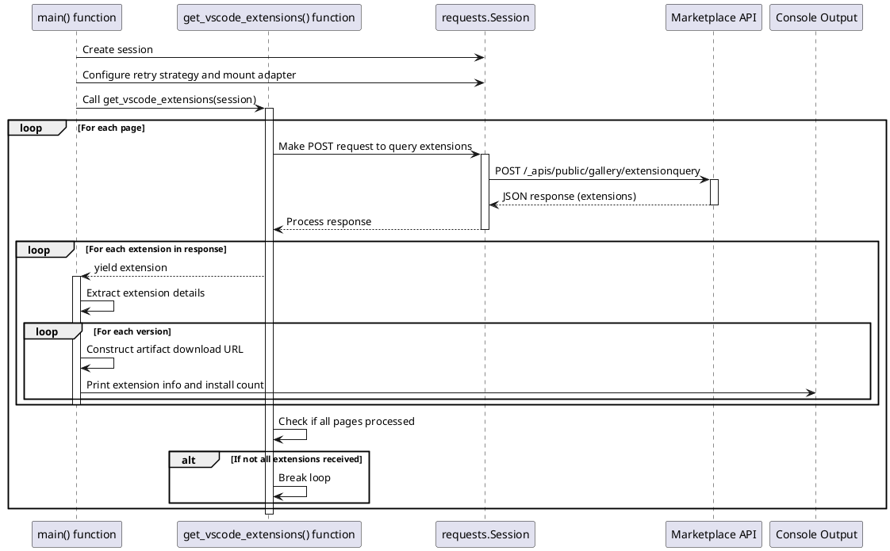

# Reverse Engineering of 

- Source: https://gist.github.com/jossef/8d7681ac0c7fd28e93147aa5044bc129

> \# aider chat started at 2025-11-02 14:06:22

> C:\Users\jazzw\.local\bin\aider --no-auto-commits --no-gitignore --model gemini/gemini-2.5-flash main.py  
> Aider v0.86.1  
> Model: gemini/gemini-2.5-flash with diff-fenced edit format  
> Git repo: .git with 1 files  
> Repo-map: using 4096 tokens, auto refresh  
> Added main.py to the chat.  

> ##### /ask could you draw a sequence diagram of main.py using PlantUML syntax?  

> ###### 2025-11-02 14:12:12.781838
> ###### help me to add comments to main.py

> ###### /ask help me to code review main.py  

Here's a code review of `main.py`:

**Function: `get_vscode_extensions`**

1.  **Duplicate Flag Assignments:** There are two instances where the same flag is set multiple times for the same condition:
    *   `if include_category_and_tags: flags |= 0x4` appears twice consecutively.
    *   `if include_shared_accounts: flags |= 0x8` also appears twice consecutively.
    While setting a bit flag multiple times with the same value does not change the final `flags` value, it is redundant and could indicate a copy-paste error or an intended, but missed, different flag. The comment on the second `include_shared_accounts` flag already points this out.

2.  **API Version:** The `api_version='7.2-preview.1'` is explicitly using a preview API version. This is important to be aware of, as preview APIs might have breaking changes in the future.

**Function: `main`**

1.  **`extension_description` Assignment:** The line `extension_description = extension['extensionName']` assigns the extension's name to the `extension_description` variable. As noted in the existing comment, this is likely a typo and `extension['displayName']` or `extension['shortDescription']` might be intended for a more accurate description.

Overall, the code is well-structured and includes good practices such as using a `requests.Session` with a `Retry` strategy, which enhances reliability when dealing with external APIs. The use of a generator function (`get_vscode_extensions`) is also efficient for processing large datasets.

> ###### help me to fix duplicate flag assignments  

To fix the duplicate flag assignments in `main.py`, I will remove the redundant lines for `include_category_and_tags` and `include_shared_accounts`.