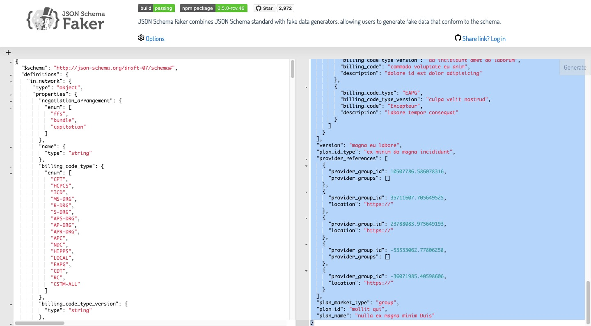

# MEMO

- ( 2023-03-02 01:22:16 )
- create project with `sbt new jazzwang/scala-spark.g8`
```bash
jazzwang:~/git/snippet/scala$ sbt new jazzwang/scala-spark.g8
[info] Loading global plugins from /Users/jazzwang/.sbt/1.0/plugins
[info] Set current project to scala (in build file:/Users/jazzwang/git/snippet/scala/)
[info] Set current project to scala (in build file:/Users/jazzwang/git/snippet/scala/)

A minimal Apache Spark project in Scala

name [Scala Spark Project]: spark-schema

Template applied in /Users/jazzwang/git/snippet/scala/./spark-schema
```
- ( 2023-03-02 01:22:45 )
- generate Fake JSON file from [MRFs In-Network Rates JSON Schema](https://raw.githubusercontent.com/CMSgov/price-transparency-guide/master/schemas/in-network-rates/in-network-rates.json)
- ( 2023-03-02 01:26:13 )
```bash
jazzwang:~/git/snippet/scala/spark-schema$ mkdir input
jazzwang:~/git/snippet/scala/spark-schema$ mkdir schema
jazzwang:~/git/snippet/scala/spark-schema$ mkdir examples
jazzwang:~/git/snippet/scala/spark-schema$ cd schema/
jazzwang:~/git/snippet/scala/spark-schema/schema$ wget https://raw.githubusercontent.com/CMSgov/price-transparency-guide/master/schemas/in-network-rates/in-network-rates.json
jazzwang:~/git/snippet/scala/spark-schema/schema$ cat in-network-rates.json | pbcopy
```
- ( 2023-03-02 01:28:06 )
- paste JSON Schema to https://json-schema-faker.js.org/

- ( 2023-03-02 01:29:44 )
```bash
jazzwang:~/git/snippet/scala/spark-schema/schema$ cd ..
jazzwang:~/git/snippet/scala/spark-schema$ cd examples/
jazzwang:~/git/snippet/scala/spark-schema/examples$ vi json-schema-faker.json
```
- paste the generated json output to `json-schema-faker.json`

- ( 2023-03-02 01:32:34 )
- convert `json-schema-faker.json` to NDJSON format with `jq -c .`
```bash
jazzwang:~/git/snippet/scala/spark-schema/examples$ cat json-schema-faker.json | jq -c . > json-schema-faker.ndjson
```
- ( 2023-03-05 11:16:27 )
- download example [MRFs In-Network Rates JSON file] to `input` folder
```bash
jazzwang:~/git/snippet/scala/spark-schema/examples$ cd ..; cd input
jazzwang:~/git/snippet/scala/spark-schema/input$ wget https://raw.githubusercontent.com/CMSgov/price-transparency-guide/master/examples/in-network-rates/in-network-rates-multiple-plans-sample.json
```
- ( 2023-03-05 11:18:29 )
- convert `in-network-rates-multiple-plans-sample.json` to NDJSON format
```bash
jazzwang:~/git/snippet/scala/spark-schema/input$ cat in-network-rates-multiple-plans-sample.json | jq -c . > in-network-rates-multiple-plans-sample.ndjson
jazzwang:~/git/snippet/scala/spark-schema/input$ cd ..
```
- ( 2023-03-05 11:19:10 )
```bash
jazzwang:~/git/snippet/scala/spark-schema$ tree
.
├── README.md
├── build.sbt
├── examples
│   ├── json-schema-faker.json
│   └── json-schema-faker.ndjson
├── images
│   └── json-schema-faker.jpg
├── input
│   ├── in-network-rates-multiple-plans-sample.json
│   └── in-network-rates-multiple-plans-sample.ndjson
├── project
│   └── build.properties
├── schema
│   └── in-network-rates.json
└── src
    ├── main
    │   ├── resources
    │   │   └── log4j.properties
    │   └── scala
    │       └── example
    │           └── Hello.scala
    └── test
        └── scala
            └── example
                └── HelloSpec.scala

14 directories, 12 files
```
- ( 2023-03-05 11:22:49 )
```bash


## Reference

- https://alvinalexander.com/scala/how-to-write-text-files-in-scala-printwriter-filewriter/
- https://github.com/atomsfat/fake-schema-cli
- https://www.jsonschema.net/app/schemas/0
- https://stackoverflow.com/questions/21894873/generate-sample-json-output-from-json-schema
- https://github.com/wolverdude/GenSON/
- https://stackoverflow.com/questions/7341537/tool-to-generate-json-schema-from-json-data
- https://stackoverflow.com/questions/69719417/pyspark-create-a-schema-from-json-file
- https://alvinalexander.com/scala/how-to-open-read-text-files-in-scala-cookbook-examples/
- https://navneethg.github.io/jsonschemaviewer/
