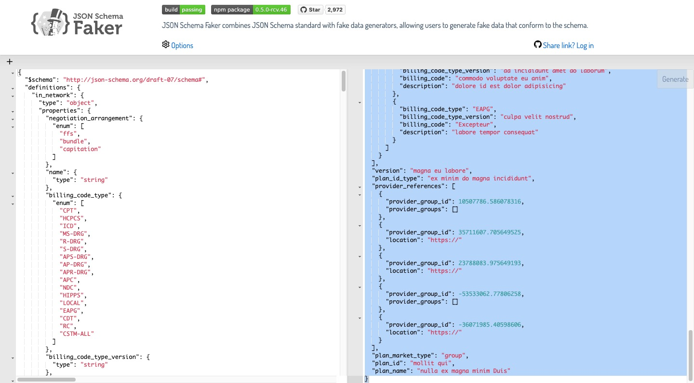

# Development Notes

## 2023-03-02

- ( 2023-03-02 01:22:16 )
- create project with `sbt new jazzwang/scala-spark.g8`
```bash
jazzwang:~/git/snippet/scala$ sbt new jazzwang/scala-spark.g8
[info] Loading global plugins from /Users/jazzwang/.sbt/1.0/plugins
[info] Set current project to scala (in build file:/Users/jazzwang/git/snippet/scala/)
[info] Set current project to scala (in build file:/Users/jazzwang/git/snippet/scala/)

A minimal Apache Spark project in Scala

name [Scala Spark Project]: spark-schema

Template applied in /Users/jazzwang/git/snippet/scala/./spark-schema
```
- ( 2023-03-02 01:22:45 )
- generate Fake JSON file from [MRFs In-Network Rates JSON Schema](https://raw.githubusercontent.com/CMSgov/price-transparency-guide/master/schemas/in-network-rates/in-network-rates.json)
- ( 2023-03-02 01:26:13 )
```bash
jazzwang:~/git/snippet/scala/spark-schema$ mkdir input
jazzwang:~/git/snippet/scala/spark-schema$ mkdir schema
jazzwang:~/git/snippet/scala/spark-schema$ mkdir examples
jazzwang:~/git/snippet/scala/spark-schema$ cd schema/
jazzwang:~/git/snippet/scala/spark-schema/schema$ wget https://raw.githubusercontent.com/CMSgov/price-transparency-guide/master/schemas/in-network-rates/in-network-rates.json
jazzwang:~/git/snippet/scala/spark-schema/schema$ cat in-network-rates.json | pbcopy
```
- ( 2023-03-02 01:28:06 )
- paste JSON Schema to https://json-schema-faker.js.org/

- ( 2023-03-02 01:29:44 )
```bash
jazzwang:~/git/snippet/scala/spark-schema/schema$ cd ..
jazzwang:~/git/snippet/scala/spark-schema$ cd examples/
jazzwang:~/git/snippet/scala/spark-schema/examples$ vi json-schema-faker.json
```
- paste the generated json output to `json-schema-faker.json`

- ( 2023-03-02 01:32:34 )
- convert `json-schema-faker.json` to NDJSON format with `jq -c .`
```bash
jazzwang:~/git/snippet/scala/spark-schema/examples$ cat json-schema-faker.json | jq -c . > json-schema-faker.ndjson
```

## 2023-03-05

- ( 2023-03-05 11:16:27 )
- download example [MRFs In-Network Rates JSON file] to `input` folder
```bash
jazzwang:~/git/snippet/scala/spark-schema/examples$ cd ..; cd input
jazzwang:~/git/snippet/scala/spark-schema/input$ wget https://raw.githubusercontent.com/CMSgov/price-transparency-guide/master/examples/in-network-rates/in-network-rates-multiple-plans-sample.json
```
- ( 2023-03-05 11:18:29 )
- convert `in-network-rates-multiple-plans-sample.json` to NDJSON format
```bash
jazzwang:~/git/snippet/scala/spark-schema/input$ cat in-network-rates-multiple-plans-sample.json | jq -c . > in-network-rates-multiple-plans-sample.ndjson
jazzwang:~/git/snippet/scala/spark-schema/input$ cd ..
```
- ( 2023-03-05 11:19:10 )
```bash
jazzwang:~/git/snippet/scala/spark-schema$ tree
.
├── README.md
├── build.sbt
├── examples
│   ├── json-schema-faker.json
│   └── json-schema-faker.ndjson
├── images
│   └── json-schema-faker.jpg
├── input
│   ├── in-network-rates-multiple-plans-sample.json
│   └── in-network-rates-multiple-plans-sample.ndjson
├── project
│   └── build.properties
├── schema
│   └── in-network-rates.json
└── src
    ├── main
    │   ├── resources
    │   │   └── log4j.properties
    │   └── scala
    │       └── example
    │           └── Hello.scala
    └── test
        └── scala
            └── example
                └── HelloSpec.scala

14 directories, 12 files
```
- ( 2023-03-05 11:22:49 )
- initial commit
```bash
jazzwang:~/git/snippet/scala/spark-schema$ git add .
jazzwang:~/git/snippet/scala/spark-schema$ git commit -m "[scala][spark-schema] initial project"
[master ec42dd8] [scala][spark-schema] initial project
 13 files changed, 913 insertions(+)
 create mode 100644 scala/spark-schema/.gitignore
 create mode 100644 scala/spark-schema/README.md
 create mode 100644 scala/spark-schema/build.sbt
 create mode 100644 scala/spark-schema/examples/json-schema-faker.json
 create mode 100644 scala/spark-schema/examples/json-schema-faker.ndjson
 create mode 100644 scala/spark-schema/images/json-schema-faker.jpg
 create mode 100644 scala/spark-schema/input/in-network-rates-multiple-plans-sample.json
 create mode 100644 scala/spark-schema/input/in-network-rates-multiple-plans-sample.ndjson
 create mode 100644 scala/spark-schema/project/build.properties
 create mode 100644 scala/spark-schema/schema/in-network-rates.json
 create mode 100644 scala/spark-schema/src/main/resources/log4j.properties
 create mode 100644 scala/spark-schema/src/main/scala/example/Hello.scala
 create mode 100644 scala/spark-schema/src/test/scala/example/HelloSpec.scala
```
- ( 2023-03-05 11:24:15 )
```bash
jazzwang:~/git/snippet/scala/spark-schema$ code src/main/scala/example/Hello.scala
```
- ( 2023-03-05 23:41:51 )
```bash
jazzwang:~/git/snippet/scala/spark-schema$ sbt run
[info] Loading global plugins from /Users/jazzwang/.sbt/1.0/plugins
[info] Loading project definition from /Users/jazzwang/git/snippet/scala/spark-schema/project
[info] Loading settings for project root from build.sbt ...
[info] Set current project to Spark in Scala Seed Project (in build file:/Users/jazzwang/git/snippet/scala/spark-schema/)
[info] Compiling 1 Scala source to /Users/jazzwang/git/snippet/scala/spark-schema/target/scala-2.12/classes ...
[info] running example.Hello
hello
root
 |-- in_network: array (nullable = true)
 |    |-- element: struct (containsNull = true)
 |    |    |-- billing_code: string (nullable = true)
 |    |    |-- billing_code_type: string (nullable = true)
 |    |    |-- billing_code_type_version: string (nullable = true)
 |    |    |-- bundled_codes: array (nullable = true)
 |    |    |    |-- element: struct (containsNull = true)
 |    |    |    |    |-- billing_code: string (nullable = true)
 |    |    |    |    |-- billing_code_type: string (nullable = true)
 |    |    |    |    |-- billing_code_type_version: string (nullable = true)
 |    |    |    |    |-- description: string (nullable = true)
 |    |    |-- covered_services: array (nullable = true)
 |    |    |    |-- element: struct (containsNull = true)
 |    |    |    |    |-- billing_code: string (nullable = true)
 |    |    |    |    |-- billing_code_type: string (nullable = true)
 |    |    |    |    |-- billing_code_type_version: string (nullable = true)
 |    |    |    |    |-- description: string (nullable = true)
 |    |    |-- description: string (nullable = true)
 |    |    |-- name: string (nullable = true)
 |    |    |-- negotiated_rates: array (nullable = true)
 |    |    |    |-- element: struct (containsNull = true)
 |    |    |    |    |-- negotiated_prices: array (nullable = true)
 |    |    |    |    |    |-- element: struct (containsNull = true)
 |    |    |    |    |    |    |-- additional_information: string (nullable = true)
 |    |    |    |    |    |    |-- billing_class: string (nullable = true)
 |    |    |    |    |    |    |-- billing_code_modifier: array (nullable = true)
 |    |    |    |    |    |    |    |-- element: string (containsNull = true)
 |    |    |    |    |    |    |-- expiration_date: string (nullable = true)
 |    |    |    |    |    |    |-- negotiated_rate: double (nullable = true)
 |    |    |    |    |    |    |-- negotiated_type: string (nullable = true)
 |    |    |    |    |    |    |-- service_code: array (nullable = true)
 |    |    |    |    |    |    |    |-- element: string (containsNull = true)
 |    |    |    |    |-- provider_groups: array (nullable = true)
 |    |    |    |    |    |-- element: struct (containsNull = true)
 |    |    |    |    |    |    |-- npi: array (nullable = true)
 |    |    |    |    |    |    |    |-- element: double (containsNull = true)
 |    |    |    |    |    |    |-- tin: struct (nullable = true)
 |    |    |    |    |    |    |    |-- type: string (nullable = true)
 |    |    |    |    |    |    |    |-- value: string (nullable = true)
 |    |    |    |    |-- provider_references: array (nullable = true)
 |    |    |    |    |    |-- element: double (containsNull = true)
 |    |    |-- negotiation_arrangement: string (nullable = true)
 |-- last_updated_on: string (nullable = true)
 |-- plan_id: string (nullable = true)
 |-- plan_id_type: string (nullable = true)
 |-- plan_market_type: string (nullable = true)
 |-- plan_name: string (nullable = true)
 |-- provider_references: array (nullable = true)
 |    |-- element: struct (containsNull = true)
 |    |    |-- location: string (nullable = true)
 |    |    |-- provider_group_id: double (nullable = true)
 |    |    |-- provider_groups: array (nullable = true)
 |    |    |    |-- element: string (containsNull = true)
 |-- reporting_entity_name: string (nullable = true)
 |-- reporting_entity_type: string (nullable = true)
 |-- version: string (nullable = true)

root
 |-- in_network: array (nullable = true)
 |    |-- element: struct (containsNull = true)
 |    |    |-- billing_code: string (nullable = true)
 |    |    |-- billing_code_type: string (nullable = true)
 |    |    |-- billing_code_type_version: string (nullable = true)
 |    |    |-- description: string (nullable = true)
 |    |    |-- name: string (nullable = true)
 |    |    |-- negotiated_rates: array (nullable = true)
 |    |    |    |-- element: struct (containsNull = true)
 |    |    |    |    |-- negotiated_prices: array (nullable = true)
 |    |    |    |    |    |-- element: struct (containsNull = true)
 |    |    |    |    |    |    |-- billing_class: string (nullable = true)
 |    |    |    |    |    |    |-- billing_code_modifier: array (nullable = true)
 |    |    |    |    |    |    |    |-- element: string (containsNull = true)
 |    |    |    |    |    |    |-- expiration_date: string (nullable = true)
 |    |    |    |    |    |    |-- negotiated_rate: double (nullable = true)
 |    |    |    |    |    |    |-- negotiated_type: string (nullable = true)
 |    |    |    |    |    |    |-- service_code: array (nullable = true)
 |    |    |    |    |    |    |    |-- element: string (containsNull = true)
 |    |    |    |    |-- provider_groups: array (nullable = true)
 |    |    |    |    |    |-- element: struct (containsNull = true)
 |    |    |    |    |    |    |-- npi: array (nullable = true)
 |    |    |    |    |    |    |    |-- element: long (containsNull = true)
 |    |    |    |    |    |    |-- tin: struct (nullable = true)
 |    |    |    |    |    |    |    |-- type: string (nullable = true)
 |    |    |    |    |    |    |    |-- value: string (nullable = true)
 |    |    |-- negotiation_arrangement: string (nullable = true)
 |-- last_updated_on: string (nullable = true)
 |-- reporting_entity_name: string (nullable = true)
 |-- reporting_entity_type: string (nullable = true)
 |-- version: string (nullable = true)

root
 |-- in_network: array (nullable = true)
 |    |-- element: struct (containsNull = true)
 |    |    |-- billing_code: string (nullable = true)
 |    |    |-- billing_code_type: string (nullable = true)
 |    |    |-- billing_code_type_version: string (nullable = true)
 |    |    |-- bundled_codes: array (nullable = true)
 |    |    |    |-- element: struct (containsNull = true)
 |    |    |    |    |-- billing_code: string (nullable = true)
 |    |    |    |    |-- billing_code_type: string (nullable = true)
 |    |    |    |    |-- billing_code_type_version: string (nullable = true)
 |    |    |    |    |-- description: string (nullable = true)
 |    |    |-- covered_services: array (nullable = true)
 |    |    |    |-- element: struct (containsNull = true)
 |    |    |    |    |-- billing_code: string (nullable = true)
 |    |    |    |    |-- billing_code_type: string (nullable = true)
 |    |    |    |    |-- billing_code_type_version: string (nullable = true)
 |    |    |    |    |-- description: string (nullable = true)
 |    |    |-- description: string (nullable = true)
 |    |    |-- name: string (nullable = true)
 |    |    |-- negotiated_rates: array (nullable = true)
 |    |    |    |-- element: struct (containsNull = true)
 |    |    |    |    |-- negotiated_prices: array (nullable = true)
 |    |    |    |    |    |-- element: struct (containsNull = true)
 |    |    |    |    |    |    |-- additional_information: string (nullable = true)
 |    |    |    |    |    |    |-- billing_class: string (nullable = true)
 |    |    |    |    |    |    |-- billing_code_modifier: array (nullable = true)
 |    |    |    |    |    |    |    |-- element: string (containsNull = true)
 |    |    |    |    |    |    |-- expiration_date: string (nullable = true)
 |    |    |    |    |    |    |-- negotiated_rate: double (nullable = true)
 |    |    |    |    |    |    |-- negotiated_type: string (nullable = true)
 |    |    |    |    |    |    |-- service_code: array (nullable = true)
 |    |    |    |    |    |    |    |-- element: string (containsNull = true)
 |    |    |    |    |-- provider_groups: array (nullable = true)
 |    |    |    |    |    |-- element: struct (containsNull = true)
 |    |    |    |    |    |    |-- npi: array (nullable = true)
 |    |    |    |    |    |    |    |-- element: double (containsNull = true)
 |    |    |    |    |    |    |-- tin: struct (nullable = true)
 |    |    |    |    |    |    |    |-- type: string (nullable = true)
 |    |    |    |    |    |    |    |-- value: string (nullable = true)
 |    |    |    |    |-- provider_references: array (nullable = true)
 |    |    |    |    |    |-- element: double (containsNull = true)
 |    |    |-- negotiation_arrangement: string (nullable = true)
 |-- last_updated_on: string (nullable = true)
 |-- plan_id: string (nullable = true)
 |-- plan_id_type: string (nullable = true)
 |-- plan_market_type: string (nullable = true)
 |-- plan_name: string (nullable = true)
 |-- provider_references: array (nullable = true)
 |    |-- element: struct (containsNull = true)
 |    |    |-- location: string (nullable = true)
 |    |    |-- provider_group_id: double (nullable = true)
 |    |    |-- provider_groups: array (nullable = true)
 |    |    |    |-- element: string (containsNull = true)
 |-- reporting_entity_name: string (nullable = true)
 |-- reporting_entity_type: string (nullable = true)
 |-- version: string (nullable = true)

[success] Total time: 28 s, completed Mar 5, 2023 11:40:44 PM


jazzwang:~/git/snippet/scala/spark-schema$ diff -Naur in-network-rates-multiple-plans-sample.df.printSchema in-network-rates-multiple-plans-sample.df.schema.printSchema | pbcopy
```
- ( 2023-03-05 23:41:58 )
- compare the difference of `printSchema` output
```diff
--- in-network-rates-multiple-plans-sample.df.printSchema	2023-03-05 23:40:44.000000000 +0800
+++ in-network-rates-multiple-plans-sample.df.schema.printSchema	2023-03-05 23:40:44.000000000 +0800
@@ -4,12 +4,25 @@
  |    |    |-- billing_code: string (nullable = true)
  |    |    |-- billing_code_type: string (nullable = true)
  |    |    |-- billing_code_type_version: string (nullable = true)
+ |    |    |-- bundled_codes: array (nullable = true)
+ |    |    |    |-- element: struct (containsNull = true)
+ |    |    |    |    |-- billing_code: string (nullable = true)
+ |    |    |    |    |-- billing_code_type: string (nullable = true)
+ |    |    |    |    |-- billing_code_type_version: string (nullable = true)
+ |    |    |    |    |-- description: string (nullable = true)
+ |    |    |-- covered_services: array (nullable = true)
+ |    |    |    |-- element: struct (containsNull = true)
+ |    |    |    |    |-- billing_code: string (nullable = true)
+ |    |    |    |    |-- billing_code_type: string (nullable = true)
+ |    |    |    |    |-- billing_code_type_version: string (nullable = true)
+ |    |    |    |    |-- description: string (nullable = true)
  |    |    |-- description: string (nullable = true)
  |    |    |-- name: string (nullable = true)
  |    |    |-- negotiated_rates: array (nullable = true)
  |    |    |    |-- element: struct (containsNull = true)
  |    |    |    |    |-- negotiated_prices: array (nullable = true)
  |    |    |    |    |    |-- element: struct (containsNull = true)
+ |    |    |    |    |    |    |-- additional_information: string (nullable = true)
  |    |    |    |    |    |    |-- billing_class: string (nullable = true)
  |    |    |    |    |    |    |-- billing_code_modifier: array (nullable = true)
  |    |    |    |    |    |    |    |-- element: string (containsNull = true)
@@ -21,12 +34,24 @@
  |    |    |    |    |-- provider_groups: array (nullable = true)
  |    |    |    |    |    |-- element: struct (containsNull = true)
  |    |    |    |    |    |    |-- npi: array (nullable = true)
- |    |    |    |    |    |    |    |-- element: long (containsNull = true)
+ |    |    |    |    |    |    |    |-- element: double (containsNull = true)
  |    |    |    |    |    |    |-- tin: struct (nullable = true)
  |    |    |    |    |    |    |    |-- type: string (nullable = true)
  |    |    |    |    |    |    |    |-- value: string (nullable = true)
+ |    |    |    |    |-- provider_references: array (nullable = true)
+ |    |    |    |    |    |-- element: double (containsNull = true)
  |    |    |-- negotiation_arrangement: string (nullable = true)
  |-- last_updated_on: string (nullable = true)
+ |-- plan_id: string (nullable = true)
+ |-- plan_id_type: string (nullable = true)
+ |-- plan_market_type: string (nullable = true)
+ |-- plan_name: string (nullable = true)
+ |-- provider_references: array (nullable = true)
+ |    |-- element: struct (containsNull = true)
+ |    |    |-- location: string (nullable = true)
+ |    |    |-- provider_group_id: double (nullable = true)
+ |    |    |-- provider_groups: array (nullable = true)
+ |    |    |    |-- element: string (containsNull = true)
  |-- reporting_entity_name: string (nullable = true)
  |-- reporting_entity_type: string (nullable = true)
  |-- version: string (nullable = true)
```
- ( 2023-03-05 23:45:40 )
- update `sbt distclean`
```bash
jazzwang:~/git/snippet/scala/spark-schema$ code build.sbt
```
- ( 2023-03-05 23:47:44 )
```bash

```

## Reference

### JSON ➜ JSON Schema

- https://www.jsonschema.net/app/schemas/0

- Ref: https://stackoverflow.com/questions/7341537/tool-to-generate-json-schema-from-json-data

### PySpark: JSON ➜ SchemaType

- https://stackoverflow.com/questions/69719417/pyspark-create-a-schema-from-json-file
  - https://stackoverflow.com/a/69722033
  ```python
  schemapath = '/path/spark-schema.json'
  with open(schemapath) as f:
    d = json.load(f)
    schemaNew = StructType.fromJson(d)
    jsonDf2 = spark.read.schema(schmaNew).json(filesToLoad)
    jsonDF2.printSchema()
  ```

### PySpark: StructType and StructField

- https://sparkbyexamples.com/pyspark/pyspark-structtype-and-structfield/

### Spark: StructType and StructField

- https://sparkbyexamples.com/spark/spark-sql-structtype-on-dataframe/

### JSON Schema ➜ JSON (Faker)

- https://json-schema-faker.js.org/
  - Source: https://github.com/json-schema-faker/json-schema-faker

- https://github.com/atomsfat/fake-schema-cli
- https://github.com/oprogramador/json-schema-faker-cli
- https://github.com/wolverdude/GenSON/

- Ref: https://stackoverflow.com/questions/21894873/generate-sample-json-output-from-json-schema

### JSON Schema Viewer

- https://navneethg.github.io/jsonschemaviewer/

### Scala: File I/O

- Write to file - https://alvinalexander.com/scala/how-to-write-text-files-in-scala-printwriter-filewriter/
- Read from file - https://alvinalexander.com/scala/how-to-open-read-text-files-in-scala-cookbook-examples/
